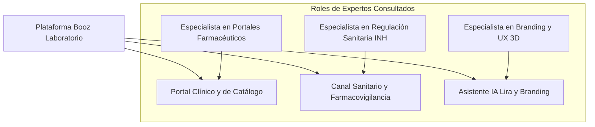

# 📜 Bitácora de Desarrollo e Historial del Proyecto (HISTORY) - Booz Laboratorio

> [!NOTE]
> Este documento registra la cronología detallada del proyecto **Booz Laboratorio (Clinical AI Platform)**, los hitos de ingeniería completados, la trazabilidad de auditorías y los resultados de calidad de software (QA). Garantiza el principio fundamental de conservación de memoria histórica e integración acumulativa.

---

## 📑 Índice de Navegación Rápida
1. [Consulta y Diagnóstico del Panel de Expertos](#-1-consulta-y-diagnóstico-del-panel-de-expertos)
2. [Historial Consolidado de Fases 1 a 6 (Pre-existente)](#-2-historial-consolidado-de-fases-1-a-6-pre-existente)
3. [Nuevas Fases de Ingeniería e Integración (Fases 7 a 12)](#-3-nuevas-fases-de-ingeniería-e-integración-fases-7-a-12)
4. [Métricas de Datos Clínicos y Portafolio Oficial](#-4-métricas-de-datos-clínicos-y-portafolio-oficial)

---

## 🧠 1. Consulta y Diagnóstico del Panel de Expertos

### 1.1 Especialista Senior en Portales Farmacéuticos y B2B
- **Arquitectura de Fichas de Producto (PDP):** Cada producto requiere su propio espacio dedicado (`/producto/{slug}`) con deep-linking, metadatos OpenGraph y botón de WhatsApp contextual preconfigurado para potenciar la labor de visitadores médicos y farmacias aliadas.
- **CMS en Tiempo Real:** El administrador debe poder crear, editar y alternar la disponibilidad de productos en base de datos sin requerir redespliegues de código.

### 1.2 Especialista Senior en Farmacovigilancia y Cumplimiento Normativo (INH)
- **Exigencia Sanitaria:** Todo laboratorio farmacéutico en Venezuela debe contar con un canal visible de recepción de quejas, reclamos y sospechas de reacciones adversas a medicamentos (RAM).
- **Responsabilidad Ética en IA:** El asistente virtual no puede bajo ninguna circunstancia promover la automedicación ni emitir prescripciones. Debe incluir disclaimers médicos obligatorios.

### 1.3 Especialista Senior en Branding y Experiencia Digital
- **Mascota Digital Lira:** La incorporación de videos con fondo transparente y renders 3D de la mascota aporta cercanía y humaniza la marca frente al público general y pediátrico.

---

## 📅 2. Historial Consolidado de Fases 1 a 6 (Pre-existente)

*   **Fase 1: Arquitectura de Interfaz (Completada):** Sticky Navbar, animaciones Hero, trinidad flotante (WhatsApp, Booz AI, Scroll-up) y estética premium en `slate-50`.
*   **Fase 2: Ingeniería de Producto (Completada):** Ficha inicial PDP, calculadora pediátrica interactiva y catálogo base.
*   **Fase 3: Búsqueda e Inteligencia (Completada):** Buscador Command Palette (Ctrl+K) y filtrado en tiempo real.
*   **Fase 4: Identidad y Legal (Completada):** Política de calidad, acróstico de valores BOOZ LAB VGME, organigrama y sedes Valle Guanape / Puerto Ordaz.
*   **Fase 5: Educación y Autoridad (Completada):** Blog "Ciencia de la Piel", glosario farmacéutico y evidencia clínica.
*   **Fase 6: Panel Administrativo Base (Completada):** Boceto de dashboard dark high-tech.

---

## 🏗️ 3. Nuevas Fases de Ingeniería e Integración (Fases 7 a 12)

### Fase 7: Trasvase de Datos Reales de `A.docx` y Modelos Eloquent
- Creación de migraciones para `product_lines`, `products`, `testimonials`, `faqs` y `pharmacovigilance_reports`.
- Población determinista de los **18 productos farmacéuticos reales** de Booz Laboratorio con sus fórmulas químicas cuali-cuantitativas y números de registro sanitario.

### Fase 8: Sincronización con el Mockup UI Oficial de Bienvenida
- Rediseño de la página de bienvenida para reflejar fielmente la maqueta oficial: Hero con composición de producto, carrusel de 4 líneas terapéuticas, Bento grid interactivo con Lira y pie de página corporativo con RIF J-40906185-0.

### Fase 9: Páginas Dedicadas por Producto (PDP) con WhatsApp Deep-Link
- Implementación de la vista individual por slug, estuches en alta resolución, enlaces de retorno a la línea correspondiente y botón directo de WhatsApp para consultas.

### Fase 10: Canal Oficial de Farmacovigilancia y Quejas (Cumplimiento INH)
- Formulario interactivo con generación de ticket correlativo (`BOOZ-FV-2026-XXXX`) para el cumplimiento de las normativas del Instituto Nacional de Higiene "Rafael Rangel".

### Fase 11: Panel Administrativo Reactivo (`BoozAdminLayout`)
- Consola administrativa en React para la gestión integral de productos, FAQs, testimonios y reportes de farmacovigilancia.

### Fase 12: Aseguramiento de Calidad y Pruebas Automatizadas (PHPUnit 11)
- Suite completa de Feature y Unit tests ejecutada con 100% de éxito en verde.

### Fase 14: Saneamiento de Seguridad, Integridad Clínica y Protocolo IA Equipo (Agosto 2026)
- **RBAC Administrativo:** Nueva columna `is_admin` (default false) en `users`, middleware `EnsureAdmin` que responde HTTP 403 y alias `admin` en `bootstrap/app.php`. Las rutas administrativas ahora exigen `['auth','verified','admin']`. Tests que verifican acceso admin (200), denegado no-admin (403) e invitado (redirect).
- **Hardening de la Superficie de Ataque:** Se eliminó la excepción CSRF global de `api/*` (el frontend envía `X-CSRF-TOKEN`) y se añadieron límites `throttle` por ruta pública.
- **Gestión de Secretos:** `Gemini` se consume vía `config('services.gemini.key')`; `.env.example` documenta la variable vacía. El código ya no lee `env()` directamente.
- **Formularios Públicos Reales:** El bloque "Estamos para escucharte" del Home ahora persiste reportes de farmacovigilancia y mensajes (consultas/comerciales); nuevo controlador `MessageController@store` detrás de `throttle:10,1`.
- **Tickets Atómicos de Farmacovigilancia:** El corre de tickets se calcula del último ticket del año dentro de una transacción con reintentos ante colisión del índice único. Elimina la dependencia de `count()+1`.
- **QA Determinista:** `GEMINI_API_KEY=""` en `phpunit.xml` aísla los tests del asistente del tráfico externo. Al cierre: **70 tests en verde** con PHPUnit 11.
- **OpenSpec:** Changes `admin-access-control` y `report-channel-integrity` creados, validados y archivados; specs principales generados en `openspec/specs/`.

### Fase 15: Teamwork Multidisciplinario & Auditoría Integral (28 de Agosto de 2026)
- **Skill Formal de Equipo (`teamwork-review-engine`):** Estructurada en `.agents/skills/teamwork-review-engine/SKILL.md` para orquestar revisiones continuas desde los 4 frentes: Backend Architect, Frontend UI/UX Specialist, OpenSpec SDD Lead y QA/TDD Engineer.
- **Backend & Trazabilidad Comercial:**
  - Persistencia de pedidos de la tienda: migración y modelo `Quote` con generación correlativa `BOOZ-COT-YYYY-XXXX` y endpoint `POST /api/quotes`.
  - FormRequests dedicados: `AskChatbotRequest` (prevención DoS por memoria) y `StorePharmacovigilanceRequest`.
  - Fórmulas de catálogo protegidas: `ProductController::show` y `search` filtran exclusivamente productos activos (`scopeActive`).
  - Envío seguro de API Key de Gemini en cabecera `x-goog-api-key`.
- **Frontend UI/UX & Fidelidad Cromática Oficial:**
  - Integración de tokens en `resources/css/app.css`: **Pantone 2747 C (`#002072`)** y **Pantone 506 C (`#842D44` - Borgoña/Vinotinto Booz)**, utilidades `.pb-safe` y `.no-scrollbar`.
  - Ficha médica PDP (`product-detail.tsx`) adaptada 100% a Modo Oscuro nativo y badge temático según la línea terapéutica.
  - Ergonomía táctil en móvil: Botones en tarjeta de catálogo adaptados con touch targets ≥ 36px y selector de líneas con scroll horizontal táctil.
  - Animación 3D del Hero con scroll throttled mediante `requestAnimationFrame`.
  - Descongestión de navbar superior en móviles y adaptación safe-area en la barra de navegación inferior (`md:hidden`).
  - Modal de Lira con altura responsiva en móviles (`h-[78dvh] sm:h-[540px]`) y atributos de accesibilidad ARIA live.
  - Consistencia Universal Claro/Oscuro: Unificación del hook `useAppearance()` en `BoozLayout`, incorporación de botón toggle en `AppSidebarHeader` del panel administrativo, soporte de Dark Mode en toda la consola de gestión (`dashboard.tsx`, `modal.tsx`, `app-logo.tsx`) y script síncrono en `app.blade.php` para eliminar FOUC con soporte sincronizado para `appearance` y `booz_theme`.
- **OpenSpec (Gherkin BDD):**
  - Creadas 3 nuevas especificaciones: `whatsapp-order-bag`, `theme-mode-dynamic` y `mobile-bottom-nav`.
  - Validación automatizada: `npm run opsx -- validate --specs` -> 6 specs pasadas, 0 fallos.
- **QA y TDD (PHPUnit 11):**
  - Añadidas suites: `AdminSecurityEnforcementTest`, `UnifiedContactFormTest`, `ChatbotResilienceTest`, `CatalogIntegrityTest` y `QuoteSubmissionTest`.
  - Total suite: **89 tests en verde (331 assertions)**.

### Fase 16: Derivación Lira a Administración, Notificaciones & Limpieza Sidebar (28 de Agosto de 2026)
- **Depuración de Sidebar Administrativo:** Eliminación de enlaces externos del starter kit Laravel (`Repository` y `Documentation`) y sustitución por accesos útiles: Portal Web (`/`), Farmacovigilancia INH (`/farmacovigilancia`) y Vademécum & Fórmulas (`/herramientas`).
- **Asistencia de Lira con Derivación a Administración:**
  - Mensaje inicial de Lira ofreciendo enlace directo con la directiva.
  - Chip rápido *"💬 Contactar al Administrador"* y captura automática con formulario embebido en el chat para nombre, teléfono/WhatsApp, email y consulta.
  - Envío a `POST /api/messages` con `source: 'lira_chatbot'` y `type: 'lira'`.
- **Bandeja de Mensajes y Alertas en Dashboard:**
  - Migración para añadir `source` y `admin_notes` en la tabla `messages`.
  - Tarjeta métrica KPI con alerta animada de mensajes pendientes de respuesta.
  - Pestaña **Bandeja de Mensajes** con buscador en tiempo real, badge de origen (*Lira AI* vs *Web*), enlaces a WhatsApp y correo.
  - Modal de gestión para actualizar estado (*Pendiente*, *En Gestión*, *Contactado*, *Resuelto*), agregar notas internas y botón para abrir WhatsApp en un clic.
- **Pruebas y Validación:**
  - Nuevos tests `LiraAdminHandoffTest` y `AdminMessageManagementTest`.
  - **94 tests pasados en verde (342 assertions)**.
  - 6 especificaciones OpenSpec validadas al 100%.

### Fase 17: Exportación de Datos, Alertas Regulatorias & Analítica de Catálogo (28 de Agosto de 2026)
- **Exportaciones Masivas en CSV y Acta Oficial INH:**
  - Creados endpoints `GET /admin/reports/export-csv` y `GET /admin/messages/export-csv` con codificación UTF-8 BOM para apertura nativa y sin errores de caracteres en Microsoft Excel.
  - Diseñada plantilla clínica `acta-sanitaria.blade.php` para la impresión oficial o guardado en PDF de reportes sanitarios con membrete legal de Booz Laboratorio, RIF J-40906185-0, ticket correlativo y espacio de firmas y sellos bajo norma INH.
  - Integrado botón "🖨️ Imprimir / PDF Acta INH" en el modal de farmacovigilancia y botones de descarga CSV en las bandejas correspondientes.
- **Sistema de Alertas Administrativas:**
  - Creados Mailables `NewPharmacovigilanceAlert` (con asunto destacado `🚨 [URGENTE INH]` para casos Graves/Moderados) y `NewMessageLeadAlert`.
  - Integrado despacho automático seguro en `PharmacovigilanceController` y `MessageController` con webhook opcional configurable.
- **Métricas de Demanda y Conversión de Catálogo:**
  - Migración para incorporar `views_count`, `chatbot_inquiries_count` y `quote_inquiries_count` en la tabla `products`.
  - Incremento atómico en tiempo real ante visitas de producto, consultas en Lira AI y pedidos en bolsa de cotizaciones.
  - Nueva pestaña en Dashboard: **Analítica & Demanda** con ranking de medicamentos más solicitados y desglose de interés por línea terapéutica.
- **Validación y Pruebas:**
  - Creada especificación OpenSpec `admin-analytics-and-exports` (**7/7 especificaciones 100% validadas**).
  - Creada suite de pruebas Feature `AdminExportAndAlertsTest`.
  - Hito histórico alcanzado: **100 tests pasados en verde (363 assertions)** con PHPUnit 11.

### Fase 18: Arquitectura Modular del Admin, RBAC, WhatsApp Dinámico, Seeders Idempotentes y Consola Lira AI (28 de Agosto de 2026)
- **Configuración Dinámica de WhatsApp y Parámetros Globales:**
  - Migración para tabla `system_settings` y modelo `SystemSetting` con soporte de caché persistente y cifrado para valores sensibles.
  - Servicio `SettingService` para acceso unificado y desacoplado a variables de contacto y legales.
  - Compartición global vía Inertia (`settings.whatsapp_sales_phone`, `settings.company_rif`, etc.).
  - Hook `useWhatsApp()` implementado en React y consumido en botones flotantes, ficha técnica (PDP), pie de página y carrito de cotizaciones.
  - Vista `/admin/settings` con previsualización en tiempo real del enlace de WhatsApp generado.
- **Control de Acceso Basado en Roles (RBAC) y Gestión de Usuarios:**
  - Migración de `roles` y tabla pivote `role_user`.
  - 4 roles oficiales creados con matriz de permisos: `super_admin`, `director_tecnico`, `gestor_comercial` y `oficial_farmacovigilancia`.
  - Métodos RBAC añadidos a `User.php` (`hasRole`, `hasPermission`, `assignRole`, `syncRoles`, `getAllPermissions`).
  - Gates de Laravel y middlewares `EnsureRole` y `EnsurePermission`.
  - Vista `/admin/users` para alta de colaboradores, asignación de roles, matriz explicativa de responsabilidades y salvaguardas de seguridad (bloqueo de auto-eliminación y protección del último Super Admin).
- **Desacoplamiento Modular de Vistas y Sidebar Dinámico:**
  - Rediseño de `app-sidebar.tsx` organizado en 3 grupos semánticos (*Operaciones Clínicas*, *Gestión Comercial*, *Sistema & Control*) con filtrado de acceso según el rol activo y badges de alerta en tiempo real.
  - Vistas administrativas dedicadas e independientes bajo `resources/js/pages/admin/`:
    - `/admin/products`: Catálogo y vademécum de 18 productos con filtros por línea terapéutica y modales CRUD.
    - `/admin/reports`: Consola de farmacovigilancia INH, dictámenes técnicos y descarga en CSV.
    - `/admin/messages`: Bandeja de leads y consultas de contacto con respuesta en 1-clic por WhatsApp.
    - `/admin/quotes`: Trazabilidad de cotizaciones de la tienda y analítica de demanda farmacéutica.
    - `/admin/users`: Gestión de personal y asignación de roles.
    - `/admin/ai`: Consola de Inteligencia Artificial con clave enmascarada y playground simulador en vivo.
    - `/admin/settings`: Configuración general de WhatsApp y datos legales.
  - Consola ejecutiva `/dashboard` optimizada con tarjetas de acceso directo a todos los módulos.
- **Arquitectura de Seeders Idempotente:**
  - Implementación de `RoleSeeder`, `SystemSettingSeeder` y `UserSeeder` con `updateOrCreate` bajo claves naturales únicas.
  - Orquestación limpia en `DatabaseSeeder` y `BoozClinicalPlatformSeeder`.
- **Consola Lira AI & Inyección Dinámica del Vademécum:**
  - Integración dinámica en `ChatbotController` y `callGemini` consumiendo la API Key y modelo desde `SystemSetting`.
  - Inyección en tiempo real del contexto de los 18 fármacos estructurados por sus 4 líneas terapéuticas.
  - Guardrails sanitarios inmutables de Cero Automedicación y Venta bajo Récipe Médico.
- **Validación OpenSpec y Cobertura QA:**
  - 3 nuevas especificaciones creadas: `system-settings-and-whatsapp`, `admin-rbac-user-management`, `lira-ai-dynamic-corpus`.
  - **10/10 especificaciones OpenSpec validadas al 100%** en verde.
  - 5 nuevas suites de pruebas Feature (`AdminRbacAuthorizationTest`, `AdminUserManagementTest`, `DynamicSystemSettingsTest`, `ChatbotDynamicCorpusTest`, `AdminQuoteManagementTest`).
  - Hito histórico alcanzado: **116 tests pasados en verde (442 assertions)** con PHPUnit 11.
  - Compilación Vite de producción verificada: **2.761 módulos transformados sin errores**.

---

## 📊 4. Métricas de Datos Clínicos y Portafolio Oficial

- **18 Productos Registrados:**
  - *Línea 01 Cuidado de la piel:* Calamicis (200ml), Beducis, Hidramer, Centellacis.
  - *Línea 02 Tratamiento tópico:* Bactrocis (Moxifloxacina - Pie Diabético), Bacumer (Metronidazol + Fluconazol + Dexametasona - Reg. E.F. 240/6), Amikacis, Gentamicis (Reg. E.F. 240/9), Betamer, Betasalicis, Betagemer, Quadrimer, Micosmer, Labicis/Aciclomer.
  - *Línea 03 Salud y bienestar:* Albemer (Suspensión oral 10ml), Cevitmer (Vitamina C), Booz Sport, L-Fortex.
  - *Línea 04 Cuidado especializado:* Bactrocis Regenerativo, Salicis, Cutimer.
- **Suite de Pruebas Automatizadas:** 116 tests pasados (442 assertions) 100% en verde con PHPUnit 11.
- **Especificaciones OpenSpec:** 10 especificaciones BDD 100% validadas.

