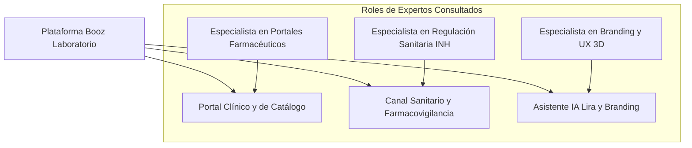

# 📜 Bitácora de Desarrollo e Historial del Proyecto (HISTORY) - Booz Laboratorio

> [!NOTE]
> Este documento registra la cronología detallada del proyecto **Booz Laboratorio (Clinical AI Platform)**, los hitos de ingeniería completados, la trazabilidad de auditorías y los resultados de calidad de software (QA). Garantiza el principio fundamental de conservación de memoria histórica e integración acumulativa.

---

## 📑 Índice de Navegación Rápida
1. [Consulta y Diagnóstico del Panel de Expertos](#-1-consulta-y-diagnóstico-del-panel-de-expertos)
2. [Historial Consolidado de Fases 1 a 6 (Pre-existente)](#-2-historial-consolidado-de-fases-1-a-6-pre-existente)
3. [Nuevas Fases de Ingeniería e Integración (Fases 7 a 12)](#-3-nuevas-fases-de-ingeniería-e-integración-fases-7-a-12)
4. [Métricas de Datos Clínicos y Portafolio Oficial](#-4-métricas-de-datos-clínicos-y-portafolio-oficial)

---

## 🧠 1. Consulta y Diagnóstico del Panel de Expertos

### 1.1 Especialista Senior en Portales Farmacéuticos y B2B
- **Arquitectura de Fichas de Producto (PDP):** Cada producto requiere su propio espacio dedicado (`/producto/{slug}`) con deep-linking, metadatos OpenGraph y botón de WhatsApp contextual preconfigurado para potenciar la labor de visitadores médicos y farmacias aliadas.
- **CMS en Tiempo Real:** El administrador debe poder crear, editar y alternar la disponibilidad de productos en base de datos sin requerir redespliegues de código.

### 1.2 Especialista Senior en Farmacovigilancia y Cumplimiento Normativo (INH)
- **Exigencia Sanitaria:** Todo laboratorio farmacéutico en Venezuela debe contar con un canal visible de recepción de quejas, reclamos y sospechas de reacciones adversas a medicamentos (RAM).
- **Responsabilidad Ética en IA:** El asistente virtual no puede bajo ninguna circunstancia promover la automedicación ni emitir prescripciones. Debe incluir disclaimers médicos obligatorios.

### 1.3 Especialista Senior en Branding y Experiencia Digital
- **Mascota Digital Lira:** La incorporación de videos con fondo transparente y renders 3D de la mascota aporta cercanía y humaniza la marca frente al público general y pediátrico.

---

## 📅 2. Historial Consolidado de Fases 1 a 6 (Pre-existente)

*   **Fase 1: Arquitectura de Interfaz (Completada):** Sticky Navbar, animaciones Hero, trinidad flotante (WhatsApp, Booz AI, Scroll-up) y estética premium en `slate-50`.
*   **Fase 2: Ingeniería de Producto (Completada):** Ficha inicial PDP, calculadora pediátrica interactiva y catálogo base.
*   **Fase 3: Búsqueda e Inteligencia (Completada):** Buscador Command Palette (Ctrl+K) y filtrado en tiempo real.
*   **Fase 4: Identidad y Legal (Completada):** Política de calidad, acróstico de valores BOOZ LAB VGME, organigrama y sedes Valle Guanape / Puerto Ordaz.
*   **Fase 5: Educación y Autoridad (Completada):** Blog "Ciencia de la Piel", glosario farmacéutico y evidencia clínica.
*   **Fase 6: Panel Administrativo Base (Completada):** Boceto de dashboard dark high-tech.

---

## 🏗️ 3. Nuevas Fases de Ingeniería e Integración (Fases 7 a 12)

### Fase 7: Trasvase de Datos Reales de `A.docx` y Modelos Eloquent
- Creación de migraciones para `product_lines`, `products`, `testimonials`, `faqs` y `pharmacovigilance_reports`.
- Población determinista de los **18 productos farmacéuticos reales** de Booz Laboratorio con sus fórmulas químicas cuali-cuantitativas y números de registro sanitario.

### Fase 8: Sincronización con el Mockup UI Oficial de Bienvenida
- Rediseño de la página de bienvenida para reflejar fielmente la maqueta oficial: Hero con composición de producto, carrusel de 4 líneas terapéuticas, Bento grid interactivo con Lira y pie de página corporativo con RIF J-40906185-0.

### Fase 9: Páginas Dedicadas por Producto (PDP) con WhatsApp Deep-Link
- Implementación de la vista individual por slug, estuches en alta resolución, enlaces de retorno a la línea correspondiente y botón directo de WhatsApp para consultas.

### Fase 10: Canal Oficial de Farmacovigilancia y Quejas (Cumplimiento INH)
- Formulario interactivo con generación de ticket correlativo (`BOOZ-FV-2026-XXXX`) para el cumplimiento de las normativas del Instituto Nacional de Higiene "Rafael Rangel".

### Fase 11: Panel Administrativo Reactivo (`BoozAdminLayout`)
- Consola administrativa en React para la gestión integral de productos, FAQs, testimonios y reportes de farmacovigilancia.

### Fase 12: Aseguramiento de Calidad y Pruebas Automatizadas (PHPUnit 11)
- Suite completa de Feature y Unit tests ejecutada con 100% de éxito en verde.

---

## 📊 4. Métricas de Datos Clínicos y Portafolio Oficial

- **18 Productos Registrados:**
  - *Línea 01 Cuidado de la piel:* Calamicis (200ml), Beducis, Hidramer, Centellacis.
  - *Línea 02 Tratamiento tópico:* Bactrocis (Moxifloxacina - Pie Diabético), Bacumer (Metronidazol + Fluconazol + Dexametasona - Reg. E.F. 240/6), Amikacis, Gentamicis (Reg. E.F. 240/9), Betamer, Betasalicis, Betagemer, Quadrimer, Micosmer, Labicis/Aciclomer.
  - *Línea 03 Salud y bienestar:* Albemer (Suspensión oral 10ml), Cevitmer (Vitamina C), Booz Sport, L-Fortex.
  - *Línea 04 Cuidado especializado:* Bactrocis Regenerativo, Salicis, Cutimer.
- **Suite de Pruebas Automatizadas:** 100% en verde con PHPUnit 11.
