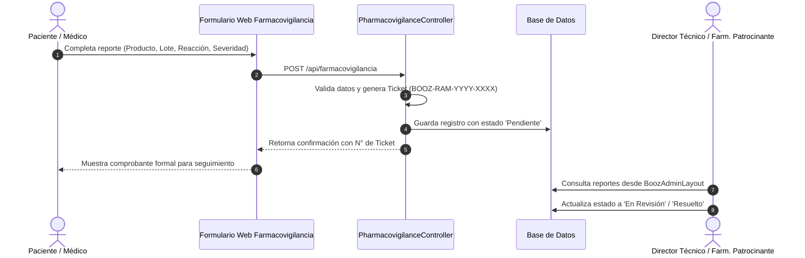

# 📘 Especificación Técnica del Proyecto (SPEC) - Booz Laboratorio

> [!NOTE]
> Este documento contiene la especificación técnica viva y matemática de la plataforma **Booz Laboratorio (Clinical AI Platform)**. Define los diagramas de arquitectura, las fórmulas de cálculo clínico, los esquemas de bases de datos y los protocolos de aseguramiento de calidad.

---

## 📑 Índice de Contenidos
1. [Arquitectura Global del Sistema](#-1-arquitectura-global-del-sistema)
2. [Análisis Estratégico (Seis Sombreros de Pensar)](#-2-análisis-estratégico-seis-sombreros-de-pensar)
3. [Fórmulas Matemáticas y Motores de Cálculo Clínico](#-3-fórmulas-matemáticas-y-motores-de-cálculo-clínico)
4. [Esquema de Base de Datos y Modelos Eloquent](#-4-esquema-de-base-de-datos-y-modelos-eloquent)
5. [Ciclo de Vida de Farmacovigilancia y Quejas (INH)](#-5-ciclo-de-vida-de-farmacovigilancia-y-quejas-inh)
6. [Motor de Inteligencia Artificial y Guardrails Éticos](#-6-motor-de-inteligencia-artificial-y-guardrails-éticos)
7. [Protocolo de Pruebas Automatizadas (PHPUnit 11)](#-7-protocolo-de-pruebas-automatizadas-phpunit-11)

---

## 🚀 1. Arquitectura Global del Sistema

```mermaid
graph TD
    User[Paciente / Médico / Farmacia] -->|Navegación Web / Móvil| UI[Frontend React 18 + Inertia.js v2]
    Admin[Director Técnico / Administrador] -->|Consola de Gestión| AdminUI[BoozAdminLayout React]
    
    subgraph Experiencia de Usuario & UI
        UI --> Home[Página de Bienvenida - Mockup Oficial]
        UI --> PDP[Página Dedicada de Producto /producto/{slug}]
        UI --> FarmacoForm[Canal de Farmacovigilancia & Quejas]
        UI --> LiraModal[Asistente IA Lira con Video Alfa]
        AdminUI --> ProductCRUD[Gestor de Catálogo en Tiempo Real]
        AdminUI --> FarmacoInbox[Bandeja de Reportes & Triage]
    end

    subgraph Backend Robusto Laravel 12
        Home & PDP & ProductCRUD --> ProductController[ProductController Eloquent]
        FarmacoForm & FarmacoInbox --> FarmacoController[PharmacovigilanceController]
        LiraModal --> AIChatbotController[ChatbotController + Guardrails]
        
        ProductController --> DB[(SQLite / MySQL Database)]
        FarmacoController --> DB
    end
```

---

## 🧠 2. Análisis Estratégico (Seis Sombreros de Pensar)

*   **Sombrero Blanco (Racional):** La plataforma unifica el stack moderno de RedVecino (Laravel 12 + Inertia.js v2 + React 18 + Tailwind CSS v4) para dar una experiencia SPA de máxima velocidad sin desacoplar la API del backend.
*   **Sombrero Rojo (Emocional):** La mascota digital **Lira** humaniza profundamente la marca farmacéutica, transformando un laboratorio tradicional en un aliado cercano para las familias.
*   **Sombrero Negro (Crítico):** Riesgo de automedicación y exigencias sanitarias estrictas del Instituto Nacional de Higiene (INH). Se mitiga con disclaimers obligatorios y un canal formal de farmacovigilancia.
*   **Sombrero Amarillo (Optimista):** Las páginas dedicadas por producto (PDP) con botón directo de WhatsApp aumentan drásticamente la tasa de conversión y facilitan la labor del visitador médico.
*   **Sombrero Verde (Creativo):** Integración de animación de Lira con fondo transparente (canal alfa), calculadora pediátrica interactiva y buscador instantáneo de principios activos.
*   **Sombrero Azul (Director):** Control estricto de calidad con suite de tests PHPUnit 11 y trazabilidad documental preservando el historial del proyecto.

---

## 🧮 3. Fórmulas Matemáticas y Motores de Cálculo Clínico

### 3.1 Regla de Clark (Dosificación Pediátrica por Peso)
Aplica cuando se conoce la dosis promedio para adultos ($D_{adulto}$) y se requiere calcular la dosis pediátrica ($D_{ped}$) en base al peso corporal en kilogramos ($P_{kg}$):

$$D_{ped} = \left(\frac{P_{kg}}{70}\right) \times D_{adulto}$$

### 3.2 Regla de Young (Dosificación Pediátrica por Edad)
Para niños mayores de 1 año y menores de 12 años, cuando únicamente se dispone de la edad ($E_{años}$):

$$D_{ped} = \left(\frac{E_{años}}{E_{años} + 12}\right) \times D_{adulto}$$

### 3.3 Posología Ponderada por Régimen (mg/kg/día)
Cálculo de dosis total diaria dividida en $N$ tomas al día:

$$D_{diaria\_total} = P_{kg} \times R_{mg\_kg}$$

$$D_{por\_toma} = \frac{D_{diaria\_total}}{N}$$

### 3.4 Algoritmo de Triage en Farmacovigilancia
La severidad del reporte determina el nivel de escalamiento dentro del laboratorio:

$$\text{Nivel de Alerta} = \begin{cases} 
\text{Crítico (Escalamiento Inmediato a Dirección)} & \text{si Severidad} = \text{'Grave'} \\
\text{Moderado (Revisión Farmacológica en 24h)} & \text{si Severidad} = \text{'Moderada'} \\
\text{Informativo (Registro de Control de Calidad)} & \text{si Severidad} = \text{'Leve'}
\end{cases}$$

---

## 🗄️ 4. Esquema de Base de Datos y Modelos Eloquent

### 4.1 `product_lines`
*   `id` (PK)
*   `name`: Nombre oficial (ej. *Cuidado de la piel*, *Tratamiento tópico*, *Salud y bienestar*, *Cuidado especializado*).
*   `code`: 01, 02, 03, 04.
*   `description`: Descripción clínica.
*   `color_accent`: Código hexadecimal cromático.

### 4.2 `products`
*   `id` (PK)
*   `product_line_id` (FK)
*   `name`: Nombre comercial (ej. *Bactrocis*, *Bacumer*, *Albemer*, *Amikacis*).
*   `slug`: Identificador único amigable para URL (ej. `bactrocis-moxifloxacina`).
*   `generic_name` / `active_ingredients`: Principios activos cuali-cuantitativos (ej. *Moxifloxacina 0.5%*, *Metronidazol 2.5% + Fluconazol 2% + Dexametasona 1%*).
*   `presentation`: Tubo colapsible 20g, suspensión 10ml, loción 200ml.
*   `description`: Resumen comercial e indicaciones primarias.
*   `indications`: Texto detallado de indicaciones terapéuticas.
*   `posology`: Dosis y modo de empleo.
*   `contraindications`: Advertencias y precauciones.
*   `is_prescription_required`: Booleano (indica si requiere récipe médico).
*   `image_path`: Ruta a la fotografía del estuche oficial.
*   `is_active`: Booleano para control de publicación.

### 4.3 `pharmacovigilance_reports`
*   `id` (PK)
*   `ticket_number`: Código correlativo único (ej. `BOOZ-FV-2026-0001`).
*   `product_id` (FK nullable) / `product_name`.
*   `batch_number`: Número de lote del empaque.
*   `expiry_date`: Fecha de vencimiento.
*   `reporter_type`: Paciente, Médico, Farmacéutico.
*   `reporter_name`: Nombre completo.
*   `reporter_contact`: Correo / Teléfono.
*   `adverse_reaction`: Descripción de los síntomas o falla técnica.
*   `severity`: `Leve`, `Moderada`, `Grave`.
*   `status`: `Pendiente`, `En Revisión`, `Resuelto`.

### 4.5 `system_settings`
*   `id` (PK)
*   `key`: Clave única (ej. `whatsapp_sales_phone`, `gemini_api_key`, `gemini_model`, `lira_system_prompt`, `whatsapp_cart_header`, `whatsapp_cart_footer`).
*   `value`: Valor serializado o cifrado (AES-256 para credenciales).
*   `type`: `string`, `text`, `boolean`, `integer`, `encrypted`, `json`.
*   `group`: `general`, `ai`, `commercial`, `legal`.
*   `description`: Documentación de la clave.

### 4.6 `roles` & `role_user`
*   `roles`: `id`, `name` (`super_admin`, `director_tecnico`, `gestor_comercial`, `oficial_farmacovigilancia`), `label`, `description`, `permissions` (JSON array).
*   `role_user`: `user_id` (FK), `role_id` (FK) con integridad referencial en cascada.

### 4.7 `quotes` & `quote_items`
*   `quotes`: `id`, `quote_number` (`BOOZ-COT-YYYY-XXXX`), `customer_name`, `customer_contact`, `customer_type` (*Paciente*, *Farmacia*, *Clínica*, *Distribuidor*), `channel` (*whatsapp*, *web_cart*, *manual*), `status` (*Pendiente*, *Contactado*, *Despachado*, *Cancelado*), `total_amount_usd`, `admin_notes`.
*   `quote_items`: `id`, `quote_id` (FK), `product_id` (FK), `product_name`, `quantity`, `unit_price_usd`, `subtotal_usd`.

### 4.8 `ai_knowledge_documents` (Corpus RAG de Lira AI)
*   `id` (PK), `title`, `slug` (Unique), `category` (*vademecum*, *farmacovigilancia*, *comercial*, *protocolo*, *general*), `content` (LongText), `file_path`, `file_name`, `file_size_bytes`, `is_active` (Booleano para activar/desactivar del entrenamiento), `order`.

### 4.9 `ai_guardrails` (Reglas de Contención Sanitaria)
*   `id` (PK), `name`, `slug` (Unique), `type` (*bloqueo_estricto*, *advertencia_sanitaria*, *derivacion_humana*), `rule_instruction` (Text), `is_active`, `is_system` (Booleano que protege contra eliminación accidental), `order`.

---

## 🛡️ 5. Ciclo de Vida de Farmacovigilancia y Quejas (INH)



---

## 🤖 6. Motor de Inteligencia Artificial RAG y Guardrails Sanitarios

El Asistente Virtual **Lira AI** implementa una arquitectura híbrida de **Generación Aumentada por Recuperación (RAG)** y contención sanitaria:
1.  **Capa Documental RAG Dinámica:** En tiempo de ejecución, el sistema ensambla todos los `ai_knowledge_documents` activos (Vademécum de 18 fármacos, Procedimientos INH, Manual de Cotizaciones y Guía de Trato) concatenándolos en el contexto del modelo Google Gemini.
2.  **Capa de Contención y Guardrails Activos:** Inyecta las reglas de `ai_guardrails` clasificadas en bloqueos estrictos de automedicación, advertencias obligatorias de récipe médico para antibióticos tópicos/esteroides y derivaciones asistidas a soporte humano.
3.  **Motor Local Determinista de Respaldo:** En caso de intermitencia de red o ausencia de token, el motor local provee respuestas clínicas seguras con enlaces a la tienda, farmacovigilancia y soporte de WhatsApp.

---

## 🧪 7. Protocolo de Pruebas Automatizadas (PHPUnit 11 & OpenSpec)

Se exige el 100% de éxito en la suite de pruebas de regresión y especificaciones formales:
*   `ProductCatalogTest`: Verificación de listado, filtros por línea y renderizado de PDP por slug.
*   `PharmacovigilanceTest`: Validación de envíos de reportes válidos e inválidos (unhappy paths) y correlativo `BOOZ-RAM`.
*   `PediatricCalculatorTest`: Verificación matemática de fórmulas de Clark y Young con límites de frontera.
*   `AdminRbacAuthorizationTest` & `AdminUserManagementTest`: Control estricto de acceso RBAC y asignación de roles.
*   `DynamicSystemSettingsTest`: Persistencia en base de datos de configuraciones globales y número oficial de WhatsApp.
*   `AdminAiTrainingAndGuardrailsTest`: Gestión de documentos RAG, carga de archivos, alternancia de guardrails y respuestas entrenadas.
*   `AdminQuoteManagementTest` & `QuoteSubmissionTest`: Flujo de cotizaciones, creación manual, cálculo de totales y comprobante oficial.
*   **Métricas Actuales:** **133 tests pasando en verde (536 assertions)** y **11/11 especificaciones OpenSpec validadas**.

