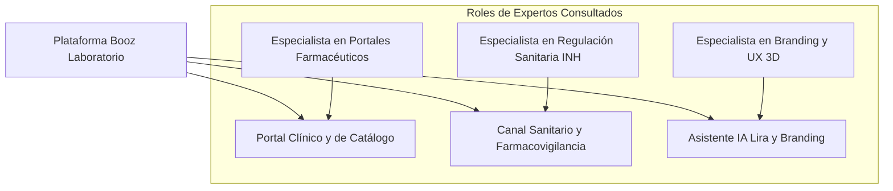

# 📜 Bitácora de Desarrollo e Historial del Proyecto (HISTORY) - Booz Laboratorio

> [!NOTE]
> Este documento registra la cronología detallada del proyecto **Booz Laboratorio (Clinical AI Platform)**, los hitos de ingeniería completados, la trazabilidad de auditorías y los resultados de calidad de software (QA). Garantiza el principio fundamental de conservación de memoria histórica e integración acumulativa.

---

## 📑 Índice de Navegación Rápida
1. [Consulta y Diagnóstico del Panel de Expertos](#-1-consulta-y-diagnóstico-del-panel-de-expertos)
2. [Historial Consolidado de Fases 1 a 6 (Pre-existente)](#-2-historial-consolidado-de-fases-1-a-6-pre-existente)
3. [Nuevas Fases de Ingeniería e Integración (Fases 7 a 12)](#-3-nuevas-fases-de-ingeniería-e-integración-fases-7-a-12)
4. [Métricas de Datos Clínicos y Portafolio Oficial](#-4-métricas-de-datos-clínicos-y-portafolio-oficial)

---

## 🧠 1. Consulta y Diagnóstico del Panel de Expertos

### 1.1 Especialista Senior en Portales Farmacéuticos y B2B
- **Arquitectura de Fichas de Producto (PDP):** Cada producto requiere su propio espacio dedicado (`/producto/{slug}`) con deep-linking, metadatos OpenGraph y botón de WhatsApp contextual preconfigurado para potenciar la labor de visitadores médicos y farmacias aliadas.
- **CMS en Tiempo Real:** El administrador debe poder crear, editar y alternar la disponibilidad de productos en base de datos sin requerir redespliegues de código.

### 1.2 Especialista Senior en Farmacovigilancia y Cumplimiento Normativo (INH)
- **Exigencia Sanitaria:** Todo laboratorio farmacéutico en Venezuela debe contar con un canal visible de recepción de quejas, reclamos y sospechas de reacciones adversas a medicamentos (RAM).
- **Responsabilidad Ética en IA:** El asistente virtual no puede bajo ninguna circunstancia promover la automedicación ni emitir prescripciones. Debe incluir disclaimers médicos obligatorios.

### 1.3 Especialista Senior en Branding y Experiencia Digital
- **Mascota Digital Lira:** La incorporación de videos con fondo transparente y renders 3D de la mascota aporta cercanía y humaniza la marca frente al público general y pediátrico.

---

## 📅 2. Historial Consolidado de Fases 1 a 6 (Pre-existente)

*   **Fase 1: Arquitectura de Interfaz (Completada):** Sticky Navbar, animaciones Hero, trinidad flotante (WhatsApp, Booz AI, Scroll-up) y estética premium en `slate-50`.
*   **Fase 2: Ingeniería de Producto (Completada):** Ficha inicial PDP, calculadora pediátrica interactiva y catálogo base.
*   **Fase 3: Búsqueda e Inteligencia (Completada):** Buscador Command Palette (Ctrl+K) y filtrado en tiempo real.
*   **Fase 4: Identidad y Legal (Completada):** Política de calidad, acróstico de valores BOOZ LAB VGME, organigrama y sedes Valle Guanape / Puerto Ordaz.
*   **Fase 5: Educación y Autoridad (Completada):** Blog "Ciencia de la Piel", glosario farmacéutico y evidencia clínica.
*   **Fase 6: Panel Administrativo Base (Completada):** Boceto de dashboard dark high-tech.

---

## 🏗️ 3. Nuevas Fases de Ingeniería e Integración (Fases 7 a 12)

### Fase 7: Trasvase de Datos Reales de `A.docx` y Modelos Eloquent
- Creación de migraciones para `product_lines`, `products`, `testimonials`, `faqs` y `pharmacovigilance_reports`.
- Población determinista de los **18 productos farmacéuticos reales** de Booz Laboratorio con sus fórmulas químicas cuali-cuantitativas y números de registro sanitario.

### Fase 8: Sincronización con el Mockup UI Oficial de Bienvenida
- Rediseño de la página de bienvenida para reflejar fielmente la maqueta oficial: Hero con composición de producto, carrusel de 4 líneas terapéuticas, Bento grid interactivo con Lira y pie de página corporativo con RIF J-40906185-0.

### Fase 9: Páginas Dedicadas por Producto (PDP) con WhatsApp Deep-Link
- Implementación de la vista individual por slug, estuches en alta resolución, enlaces de retorno a la línea correspondiente y botón directo de WhatsApp para consultas.

### Fase 10: Canal Oficial de Farmacovigilancia y Quejas (Cumplimiento INH)
- Formulario interactivo con generación de ticket correlativo (`BOOZ-FV-2026-XXXX`) para el cumplimiento de las normativas del Instituto Nacional de Higiene "Rafael Rangel".

### Fase 11: Panel Administrativo Reactivo (`BoozAdminLayout`)
- Consola administrativa en React para la gestión integral de productos, FAQs, testimonios y reportes de farmacovigilancia.

### Fase 12: Aseguramiento de Calidad y Pruebas Automatizadas (PHPUnit 11)
- Suite completa de Feature y Unit tests ejecutada con 100% de éxito en verde.

### Fase 14: Saneamiento de Seguridad, Integridad Clínica y Protocolo IA Equipo (Agosto 2026)
- **RBAC Administrativo:** Nueva columna `is_admin` (default false) en `users`, middleware `EnsureAdmin` que responde HTTP 403 y alias `admin` en `bootstrap/app.php`. Las rutas administrativas ahora exigen `['auth','verified','admin']`. Tests que verifican acceso admin (200), denegado no-admin (403) e invitado (redirect).
- **Hardening de la Superficie de Ataque:** Se eliminó la excepción CSRF global de `api/*` (el frontend envía `X-CSRF-TOKEN`) y se añadieron límites `throttle` por ruta pública.
- **Gestión de Secretos:** `Gemini` se consume vía `config('services.gemini.key')`; `.env.example` documenta la variable vacía. El código ya no lee `env()` directamente.
- **Formularios Públicos Reales:** El bloque "Estamos para escucharte" del Home ahora persiste reportes de farmacovigilancia y mensajes (consultas/comerciales); nuevo controlador `MessageController@store` detrás de `throttle:10,1`.
- **Tickets Atómicos de Farmacovigilancia:** El corre de tickets se calcula del último ticket del año dentro de una transacción con reintentos ante colisión del índice único. Elimina la dependencia de `count()+1`.
- **QA Determinista:** `GEMINI_API_KEY=""` en `phpunit.xml` aísla los tests del asistente del tráfico externo. Al cierre: **70 tests en verde** con PHPUnit 11.
- **OpenSpec:** Changes `admin-access-control` y `report-channel-integrity` creados, validados y archivados; specs principales generados en `openspec/specs/`.

### Fase 15: Teamwork Multidisciplinario & Auditoría Integral (28 de Agosto de 2026)
- **Skill Formal de Equipo (`teamwork-review-engine`):** Estructurada en `.agents/skills/teamwork-review-engine/SKILL.md` para orquestar revisiones continuas desde los 4 frentes: Backend Architect, Frontend UI/UX Specialist, OpenSpec SDD Lead y QA/TDD Engineer.
- **Backend & Trazabilidad Comercial:**
  - Persistencia de pedidos de la tienda: migración y modelo `Quote` con generación correlativa `BOOZ-COT-YYYY-XXXX` y endpoint `POST /api/quotes`.
  - FormRequests dedicados: `AskChatbotRequest` (prevención DoS por memoria) y `StorePharmacovigilanceRequest`.
  - Fórmulas de catálogo protegidas: `ProductController::show` y `search` filtran exclusivamente productos activos (`scopeActive`).
  - Envío seguro de API Key de Gemini en cabecera `x-goog-api-key`.
- **Frontend UI/UX & Fidelidad Cromática Oficial:**
  - Integración de tokens en `resources/css/app.css`: **Pantone 2747 C (`#002072`)** y **Pantone 506 C (`#842D44` - Borgoña/Vinotinto Booz)**, utilidades `.pb-safe` y `.no-scrollbar`.
  - Ficha médica PDP (`product-detail.tsx`) adaptada 100% a Modo Oscuro nativo y badge temático según la línea terapéutica.
  - Ergonomía táctil en móvil: Botones en tarjeta de catálogo adaptados con touch targets ≥ 36px y selector de líneas con scroll horizontal táctil.
  - Animación 3D del Hero con scroll throttled mediante `requestAnimationFrame`.
  - Descongestión de navbar superior en móviles y adaptación safe-area en la barra de navegación inferior (`md:hidden`).
  - Modal de Lira con altura responsiva en móviles (`h-[78dvh] sm:h-[540px]`) y atributos de accesibilidad ARIA live.
  - Consistencia Universal Claro/Oscuro: Unificación del hook `useAppearance()` en `BoozLayout`, incorporación de botón toggle en `AppSidebarHeader` del panel administrativo, soporte de Dark Mode en toda la consola de gestión (`dashboard.tsx`, `modal.tsx`, `app-logo.tsx`) y script síncrono en `app.blade.php` para eliminar FOUC con soporte sincronizado para `appearance` y `booz_theme`.
- **OpenSpec (Gherkin BDD):**
  - Creadas 3 nuevas especificaciones: `whatsapp-order-bag`, `theme-mode-dynamic` y `mobile-bottom-nav`.
  - Validación automatizada: `npm run opsx -- validate --specs` -> 6 specs pasadas, 0 fallos.
- **QA y TDD (PHPUnit 11):**
  - Añadidas suites: `AdminSecurityEnforcementTest`, `UnifiedContactFormTest`, `ChatbotResilienceTest`, `CatalogIntegrityTest` y `QuoteSubmissionTest`.
  - Total suite: **89 tests en verde (331 assertions)**.

### Fase 16: Derivación Lira a Administración, Notificaciones & Limpieza Sidebar (28 de Agosto de 2026)
- **Depuración de Sidebar Administrativo:** Eliminación de enlaces externos del starter kit Laravel (`Repository` y `Documentation`) y sustitución por accesos útiles: Portal Web (`/`), Farmacovigilancia INH (`/farmacovigilancia`) y Vademécum & Fórmulas (`/herramientas`).
- **Asistencia de Lira con Derivación a Administración:**
  - Mensaje inicial de Lira ofreciendo enlace directo con la directiva.
  - Chip rápido *"💬 Contactar al Administrador"* y captura automática con formulario embebido en el chat para nombre, teléfono/WhatsApp, email y consulta.
  - Envío a `POST /api/messages` con `source: 'lira_chatbot'` y `type: 'lira'`.
- **Bandeja de Mensajes y Alertas en Dashboard:**
  - Migración para añadir `source` y `admin_notes` en la tabla `messages`.
  - Tarjeta métrica KPI con alerta animada de mensajes pendientes de respuesta.
  - Pestaña **Bandeja de Mensajes** con buscador en tiempo real, badge de origen (*Lira AI* vs *Web*), enlaces a WhatsApp y correo.
  - Modal de gestión para actualizar estado (*Pendiente*, *En Gestión*, *Contactado*, *Resuelto*), agregar notas internas y botón para abrir WhatsApp en un clic.
- **Pruebas y Validación:**
  - Nuevos tests `LiraAdminHandoffTest` y `AdminMessageManagementTest`.
  - **94 tests pasados en verde (342 assertions)**.
  - 6 especificaciones OpenSpec validadas al 100%.

### Fase 17: Exportación de Datos, Alertas Regulatorias & Analítica de Catálogo (28 de Agosto de 2026)
- **Exportaciones Masivas en CSV y Acta Oficial INH:**
  - Creados endpoints `GET /admin/reports/export-csv` y `GET /admin/messages/export-csv` con codificación UTF-8 BOM para apertura nativa y sin errores de caracteres en Microsoft Excel.
  - Diseñada plantilla clínica `acta-sanitaria.blade.php` para la impresión oficial o guardado en PDF de reportes sanitarios con membrete legal de Booz Laboratorio, RIF J-40906185-0, ticket correlativo y espacio de firmas y sellos bajo norma INH.
  - Integrado botón "🖨️ Imprimir / PDF Acta INH" en el modal de farmacovigilancia y botones de descarga CSV en las bandejas correspondientes.
- **Sistema de Alertas Administrativas:**
  - Creados Mailables `NewPharmacovigilanceAlert` (con asunto destacado `🚨 [URGENTE INH]` para casos Graves/Moderados) y `NewMessageLeadAlert`.
  - Integrado despacho automático seguro en `PharmacovigilanceController` y `MessageController` con webhook opcional configurable.
- **Métricas de Demanda y Conversión de Catálogo:**
  - Migración para incorporar `views_count`, `chatbot_inquiries_count` y `quote_inquiries_count` en la tabla `products`.
  - Incremento atómico en tiempo real ante visitas de producto, consultas en Lira AI y pedidos en bolsa de cotizaciones.
  - Nueva pestaña en Dashboard: **Analítica & Demanda** con ranking de medicamentos más solicitados y desglose de interés por línea terapéutica.
- **Validación y Pruebas:**
  - Creada especificación OpenSpec `admin-analytics-and-exports` (**7/7 especificaciones 100% validadas**).
  - Creada suite de pruebas Feature `AdminExportAndAlertsTest`.
  - Hito histórico alcanzado: **100 tests pasados en verde (363 assertions)** con PHPUnit 11.

### Fase 18: Arquitectura Modular del Admin, RBAC, WhatsApp Dinámico, Seeders Idempotentes y Consola Lira AI (28 de Agosto de 2026)
- **Configuración Dinámica de WhatsApp y Parámetros Globales:**
  - Migración para tabla `system_settings` y modelo `SystemSetting` con soporte de caché persistente y cifrado para valores sensibles.
  - Servicio `SettingService` para acceso unificado y desacoplado a variables de contacto y legales.
  - Compartición global vía Inertia (`settings.whatsapp_sales_phone`, `settings.company_rif`, etc.).
  - Hook `useWhatsApp()` implementado en React y consumido en botones flotantes, ficha técnica (PDP), pie de página y carrito de cotizaciones.
  - Vista `/admin/settings` con previsualización en tiempo real del enlace de WhatsApp generado.
- **Control de Acceso Basado en Roles (RBAC) y Gestión de Usuarios:**
  - Migración de `roles` y tabla pivote `role_user`.
  - 4 roles oficiales creados con matriz de permisos: `super_admin`, `director_tecnico`, `gestor_comercial` y `oficial_farmacovigilancia`.
  - Métodos RBAC añadidos a `User.php` (`hasRole`, `hasPermission`, `assignRole`, `syncRoles`, `getAllPermissions`).
  - Gates de Laravel y middlewares `EnsureRole` y `EnsurePermission`.
  - Vista `/admin/users` para alta de colaboradores, asignación de roles, matriz explicativa de responsabilidades y salvaguardas de seguridad (bloqueo de auto-eliminación y protección del último Super Admin).
- **Desacoplamiento Modular de Vistas y Sidebar Dinámico:**
  - Rediseño de `app-sidebar.tsx` unificando bajo el grupo **"Operaciones"** las 4 áreas principales del laboratorio: Gestión de Catálogo (`/admin/products`), Farmacovigilancia INH (`/admin/reports`), Bandeja de Mensajes (`/admin/messages`) y Analítica & Cotizaciones (`/admin/quotes`), con filtrado por rol y badges reactivos.
  - Vistas administrativas dedicadas e independientes bajo `resources/js/pages/admin/`:
    - `/admin/products`: Catálogo farmacéutico con filtros por nombres reales de líneas terapéuticas (*Cuidado de la piel*, *Tratamiento tópico*, *Salud y bienestar*, *Cuidado especializado*), columnas dedicadas e independientes de **Producto** y **Presentación**, miniaturas fotográficas y nueva pestaña/sección de **Editor Integral de Landing Page & Ficha Médica** (fotografías, posología, indicaciones, precauciones y vista previa en vivo).
    - `/admin/reports`: Consola de farmacovigilancia INH, dictámenes técnicos y descarga en CSV.
    - `/admin/messages`: Bandeja de leads y consultas de contacto con respuesta en 1-clic por WhatsApp.
    - `/admin/quotes`: Administrador Integral de Tienda Virtual: CRUD de cotizaciones con filtros, creación de cotizaciones manuales, carga rápida de unidades disponibles/stock, comprobante oficial imprimible (`quote-voucher`), analítica de canales, exportación CSV y resiliencia de modales con soporte unificado de `isOpen` y `show`.
    - `/admin/users`: Gestión de personal y asignación de roles.
    - `/admin/ai`: Consola de Inteligencia Artificial con clave enmascarada y playground simulador en vivo.
    - `/admin/settings`: Configuración general de WhatsApp, personalización de plantillas de mensajes para la bolsa de pedidos de la tienda, perfiles de clientes y datos legales.
  - Consola ejecutiva `/dashboard` optimizada con KPIs superiores en tiempo real y 4 fichas destacadas de acceso rápido a las operaciones farmacéuticas, liberando la página de tablas pesadas de catálogo.
- **Arquitectura de Seeders Idempotente y Generosa:**
  - `UserSeeder`: 5 usuarios con contraseñas seguras y asignación a los 4 roles oficiales del laboratorio.
  - `MessageSeeder`: 12 mensajes y leads de pacientes, farmacias aliadas, clínicas y doctores provenientes tanto de Lira AI como de la web.
  - `QuoteSeeder`: 8 cotizaciones completas con ítems del catálogo y sincronización atómica de métricas de demanda por producto.
  - `PharmacovigilanceReportSeeder`: 6 reportes clínicos con lotes, fechas de caducidad, severidades y dictámenes técnicos INH.
  - Orquestación limpia en `DatabaseSeeder` y `BoozClinicalPlatformSeeder` bajo `updateOrCreate`.
- **Consola Lira AI & Inyección Dinámica del Vademécum:**
  - Integración dinámica en `ChatbotController` y `callGemini` consumiendo la API Key y modelo desde `SystemSetting`.
  - Inyección en tiempo real del contexto de los 18 fármacos estructurados por sus 4 líneas terapéuticas.
  - Guardrails sanitarios inmutables de Cero Automedicación y Venta bajo Récipe Médico.
- **Base de Conocimiento RAG y Guardrails Sanitarios Configurables (`/admin/ai`):**
  - Creación de modelos y tablas `AiKnowledgeDocument` y `AiGuardrail`.
  - Seeder `AiKnowledgeAndGuardrailSeeder` precargando:
    1. *Vademécum Maestro & Fórmulas de los 18 Productos Oficiales de Booz Laboratorio*.
    2. *Protocolo Operativo Estándar de Farmacovigilancia INH Rafael Rangel*.
    3. *Manual de Cotizaciones, Venta Institucional y Logística de Despacho*.
    4. *Guía de Trato, Empatía y Protocolos de Comunicación de Lira AI*.
  - Rediseño de la consola `/admin/ai` con 4 pestañas: Base de Conocimiento Documental (CRUD, subida de archivos `.txt`/`.md`, vista previa completa y toggle para activar/desactivar documentos), Guardrails Sanitarios (reglas de bloqueo estricto, advertencia y derivación con protección de reglas de sistema), Playground Simulador en vivo y Configuración de Motor Gemini.
  - Conexión reactiva en `ChatbotController` que ensambla dinámicamente todos los documentos activos y guardrails en el system prompt de Gemini y en el motor determinista local.
- **Fase 20: Hoja de Ruta & Checklist de Despliegue a Producción:**
  - Creación del documento maestro [`ROADMAP_AND_DEPLOYMENT_CHECKLIST.md`](file:///C:/xampp/htdocs/BoozLab/ROADMAP_AND_DEPLOYMENT_CHECKLIST.md) con la auditoría de módulos terminados, tareas operativas previas al lanzamiento (API Key definitiva de Gemini, credenciales SMTP corporativas, webhook de alertas) y guía técnica de despliegue en servidor web.
- **Validación OpenSpec y Cobertura QA:**
  - 5 nuevas especificaciones creadas: `system-settings-and-whatsapp`, `admin-rbac-user-management`, `lira-ai-dynamic-corpus`, `lira-ai-training-and-guardrails`, `admin-quotes-and-store-manager`.
  - **12/12 especificaciones OpenSpec validadas al 100%** en verde.
  - 6 nuevas suites de pruebas Feature (`AdminAiTrainingAndGuardrailsTest`, `AdminRbacAuthorizationTest`, `AdminUserManagementTest`, `DynamicSystemSettingsTest`, `ChatbotDynamicCorpusTest`, `AdminQuoteManagementTest`).
  - Hito histórico alcanzado: **133 tests pasados en verde (536 assertions)** con PHPUnit 11.
- **Fase 21: Experiencia de Catálogo en Landing Page — Carrusel Infinito con Efecto Peek, Tarjeta 100% Clickeable, Desincorporación de WhatsApp & Transición Suave (29 de Agosto de 2026):**
  - **Carrusel Infinito con Efecto Peek:** Arquitectura circular con buffer triple de copias y reposicionamiento sin parpadeo (`transition: none`). Permite visualizar 3 tarjetas centrales en desktop (`lg`), 2 en tablet y 1 en móvil, dejando asomar en los extremos laterales un porcentaje exacto de las tarjetas anterior y siguiente para invitar al usuario a la exploración.
  - **Soporte Táctil:** Captura de eventos gestuales swipe nativos (`onTouchStart`, `onTouchMove`, `onTouchEnd`) para celulares.
  - **Controles Clínicos:** Flechas flotantes circulares en blanco translúcido (`ChevronLeft`, `ChevronRight`) y barra de dots interactivos con contador en tiempo real.
  - **Tarjeta 100% Clickeable:** Todo el marco de la tarjeta enlaza a la Ficha Técnica Médica (`/producto/{slug}`) con micro-interacciones de hover y escalado sutil.
  - **Desincorporación de WhatsApp & Reubicación de Pedido:** Supresión del botón de WhatsApp en la tarjeta y reubicación ergonómica de "+ Pedido" en el pie de la tarjeta con `e.stopPropagation()` y `e.preventDefault()`.
  - **Transición Suave entre Filtros:** Implementado sistema de desvanecimiento suave de 220ms (`opacity-0 translate-y-2 scale-[0.98] blur-[0.5px]`) al cambiar entre líneas terapéuticas o necesidades del Bento Grid.
  - **Métricas:** Compilación Vite en verde (2.762 módulos en 7.79s), 133 tests en verde (536 assertions) y 12/12 especificaciones OpenSpec validadas.
- **Fase 22: Limpieza y Reordenamiento de la Barra de Navegación, Buscador Minimalista y Consola Médica (29 de Agosto de 2026):**
  - **Cabecera y Logo Limpio:** Logo superior simplificado a "BOOZ LABORATORIO" removiendo el subtítulo extenso para mayor pulcritud visual y ligereza.
  - **Menú Esencial de 4 Enlaces:** Navegación superior condensada en *Líneas*, *Catálogo*, *Conocimiento* y *Farmacovigilancia*.
  - **Reubicación de la Calculadora Pediátrica:** Desplazada desde la barra superior a la columna del footer "Canal Regulatorio & Herramientas", asegurando disponibilidad médica permanente sin recargar el navbar.
  - **Buscador Minimalista (Lupa):** Conversión de la barra de búsqueda en un botón de icono de lupa compacto que despliega en 1-clic el modal de búsqueda rápida con atajo `Ctrl+K`.
  - **Preservación de Tienda:** Se mantiene el botón con el carrito/bolsa de compras y contador dinámico de unidades.
  - **Modernización a "Consola":** Botón de acceso administrativo rediseñado como **"Consola"** con icono `ShieldCheck`, indicador de latido activo en verde esmeralda y estilo dark tech unificado tanto en desktop como en mobile bottom navigation.
  - **Métricas:** Compilación Vite verificada (2.762 módulos en 8.25s), 133 tests en verde (536 assertions) y 12/12 especificaciones OpenSpec validadas.
- **Fase 23: Login Corporativo con BoozLayout, Eliminación de Autoregistro Público y Botón de Nuevo Registro Administrativo para Superadmin (29 de Agosto de 2026):**
  - **Depuración de Navbar Superior:** Desincorporado el botón "Habla con Lira" de la barra superior, manteniendo a Lira disponible en el botón flotante con efecto radar y en la navegación móvil inferior.
  - **Login Corporativo Unificado:** Pantalla `/login` migrada a `BoozLayout`, incorporando la barra de navegación superior de Booz Laboratorio, selector de tema, tarjeta clínica con `ShieldCheck` y supresión total del enlace público de registro.
  - **Botón de Nuevo Registro en Dashboard:** Incorporado botón en verde esmeralda con `UserPlus` en la cabecera de `dashboard.tsx` para que el Superadmin registre colaboradores con 1 clic (`/admin/users?create=1`).
  - **Flujo de Registro con Roles en `AppLayout`:** Detección automática del parámetro `?create=1` en `users.tsx` para abrir el modal de alta con campos obligatorios: Nombre, Correo, Contraseña y selección de Rol (Super Administrador, Director Técnico, Gestor Comercial, Oficial de Farmacovigilancia).
  - **Métricas:** 133 tests en verde (536 assertions), 12/12 OpenSpec validadas y compilación Vite exitosa en 7.95s.
- **Fase 24: FAQ Comercial al Mayor, Redes Sociales Unificadas en Footer y Segmentación Multicanal de Telefonía y WhatsApp (29 de Agosto de 2026):**
  - **6ta Pregunta Frecuente (FAQ):** Incorporada 6ta FAQ sobre compras al mayor para droguerías, farmacias y clínicas en `BoozClinicalPlatformSeeder.php` y base de datos, equilibrando visualmente el acordeón en la Landing Page frente al formulario de contacto.
  - **Redes Sociales Oficiales en Footer:** Homogeneizadas las 4 redes corporativas con el identificador oficial `@booz.laboratorio`: Instagram (`@booz.laboratorio`), Facebook (`booz.laboratorio`), YouTube (`booz.laboratorio` con icono) y TikTok (`booz.laboratorio` con icono SVG).
  - **Arquitectura Multicanal de Telefonía:** Desplegada en `SettingService`, `SystemSetting` y `/admin/settings` la configuración independiente de 3 líneas con fallback dinámico: WhatsApp de Atención General (botón flotante), WhatsApp de Ventas (bolsa de pedidos) y Central Telefónica de Planta (enlace telefónico directo).
- **Fase 25: Remediación de Deuda Técnica, Calculadora Pediátrica Clínica y Desacoplamiento de LiraAiService (30 de Agosto de 2026):**
  - **Calculadora Pediátrica Clínica (Hallazgo A13):** Eliminación total de la lógica simulada "15mg/kg" y el `setTimeout`. Implementación de motor reactivo de 3 métodos estipulados en `SPEC.md §3`: Regla de Clark por peso corporal (\(D_{ped} = (P_{kg}/70) \times D_{adulto}\)), Régimen Ponderado diario fraccionado por frecuencia de tomas (\(mg/kg/día\)) con atajos clínicos (Albemer y antiparasitarios), y Regla de Young por edad (\(D_{ped} = [E_{años}/(E_{años}+12)] \times D_{adulto}\)), acompañados de descargo legal sanitario del INH.
  - **Servicio Centralizado `LiraAiService` (Hallazgos M2, E4, H8, H9, H17):** Unificación del ensamble del contexto RAG (vademécum activo, documentos de entrenamiento y guardrails sanitarios) y la comunicación con Google Gemini (`gemini-2.5-flash`). Se elimina la duplicación entre `ChatbotController` y `AdminAiController`.
  - **Deshardcodeo Dinámico de Lira (Hallazgos H1-H7):** Sustitución de valores fijos en código por resolución en tiempo real desde `SettingService` (teléfono de WhatsApp, RIF, Instagram oficial, dirección de planta en Valle de Guanape, oficinas de Puerto Ordaz y disclaimer médico legal).
  - **Consultas Dinámicas de Catálogo y Fármacos:** El conteo de líneas terapéuticas y fármacos registrados, así como las especificaciones de Bactrocis (Moxifloxacina), se obtienen de forma reactiva desde Eloquent (`Product` y `ProductLine`).
  - **Métricas:** 138 tests pasados (551 assertions) 100% en verde con PHPUnit 11, 12/12 especificaciones OpenSpec validadas y compilación Vite verificada en 9.34s.
- **Fase 26: Diagnóstico de Cuota Gemini, Paridad Total Landing vs Admin y Unificación del Modal Lira (30 de Agosto de 2026):**
  - **Causa Raíz Diagnosticada:** La API Key de Google Gemini alcanzó el límite de tasa / cuota gratuita de Google AI Studio (`HTTP 429 You exceeded your current quota`).
  - **Divergencia de Comportamiento Subsanada:** Ante el error 429 de Google, la landing page saltaba limpiamente al Motor Determinístico dinámico para garantizar continuidad de servicio médico, mientras que el simulador de admin fallaba al esperar exclusivamente a Gemini. Se refactorizó `AdminAiController@test` para invocar la misma lógica que el chatbot (`LiraAiService::answer`), logrando paridad idéntica (100%) entre el simulador y la landing page.
  - **Unificación de Instancias en el DOM:** Se eliminó la instancia duplicada de `LiraAssistantModal` en `home.tsx`. Tanto la miniatura del Bento Grid como el avatar flotante de la esquina ahora comparten la misma instancia y conservan el historial de mensajes mediante el evento desacoplado `booz:open-lira`.
- **Fase 27: Arquitectura Responsiva Tri-Nivel: Móvil (Tienda App & Consola Táctil), 1080p y 4K Ultra-Wide (30 de Agosto de 2026):**
  - **Soporte Formal Tailwind para Pantallas 4K (`app.css`):** Incorporados en `@theme` los breakpoints `--breakpoint-2xl: 96rem` (1536px), `--breakpoint-3xl: 120rem` (1920px) y `--breakpoint-4k: 160rem` (2560px), permitiendo escalado fluido en pantallas de ultra-alta definición.
  - **Expansión Fluida de Contenedores:** Reemplazados los contenedores rígidos `max-w-7xl` por la jerarquía responsiva `max-w-7xl 2xl:max-w-[1536px] 3xl:max-w-[1840px] px-3 sm:px-6 lg:px-8 2xl:px-12` a lo largo de toda la plataforma (`booz-layout.tsx`, `home.tsx`, `dashboard.tsx`, `product-detail.tsx`, `app-content.tsx`, y paneles administrativos). En monitores 4K (3840px), el contenido ya no queda atrapado en una franja angosta de 1280px.
  - **Tienda Virtual y Bolsa Móvil a Pantalla Completa (`store-cart-drawer.tsx`):** Supresión del margen residual izquierdo en móviles (`pl-0 sm:pl-10` y `w-screen max-w-full sm:max-w-md`), logrando una experiencia de compra a pantalla completa edge-to-edge con ergonomía táctil nativa.
  - **Catálogo en Teléfonos — Modo Tienda Virtual App (`home.tsx`):**
    - Creado selector de vista táctil en dispositivos móviles para alternar entre **Tienda Virtual (App Móvil con Cuadrícula de 2 Columnas)** y **Carrusel 3D**.
    - La vista de cuadrícula móvil optimiza el 100% del ancho de pantalla del smartphone con tarjetas compactas que integran miniatura de producto, badges de venta bajo récipe o libre, formulación, precio en USD y botón directo `+ Pedido`.
    - En pantallas 4K / Ultra-wide (`3xl`), el carrusel expande la visualización simultánea de 3 a 4 tarjetas completas (`cardWidthPercent: 21.5%`).
  - **Consola Administrativa Adaptativa para Teléfonos (`dashboard.tsx`, `admin/products.tsx`, `breadcrumbs.tsx`):**
    - En `admin/products.tsx`, creada la **Vista Móvil de Tarjetas Táctiles** (`block md:hidden`) que convive con la tabla tabular de 10 columnas en escritorio (`hidden md:block`). Los administradores pueden buscar fármacos, alternar estados activo/inactivo, abrir el editor o ver la ficha pública desde su teléfono sin desbordamientos horizontales.
    - En la pestaña de edición de `admin/products.tsx`, se incorporó un selector desplegable rápido para teléfonos (`block lg:hidden`) para cambiar de medicamento en edición sin tener que desplazarse por una lista vertical de 18 elementos.
    - En `dashboard.tsx`, los KPIs adoptan una cuadrícula compacta de 2 columnas en teléfonos (`grid-cols-2 lg:grid-cols-5`), y las 4 fichas operativas se alinean en 4 columnas en monitores 4K (`3xl:grid-cols-4`).
    - En `breadcrumbs.tsx`, se protegió el ancho máximo de títulos en pantallas pequeñas (`truncate max-w-[120px] sm:max-w-none`).
    - En `farmacovigilancia.tsx`, se implementó soporte 100% integral para Modo Oscuro en fondos, avisos sanitarios, inputs, botones de severidad y tarjeta de confirmación de ticket.
    - En `booz-layout.tsx`, se añadió menú hamburguesa superior (`Menu` / `X`) para dispositivos móviles y enlace directo permanente a Farmacovigilancia (`ShieldAlert` - "Vigilancia") en la barra de navegación inferior (`md:hidden`).
    - En `store-cart-drawer.tsx`, se hizo la tarjeta y mensaje de bolsa vacía ("Tu bolsa está vacía...") 100% interactiva con botón para cerrar el drawer y navegar directamente al catálogo de productos (`#productos`).
    - En `vademecum-pdf.blade.php` y `product-detail.tsx`, se diseñó e integró la **Ficha Técnica & Vademécum Clínico Oficial en formato PDF imprimible** (`/producto/{slug}/vademecum`) con diseño corporativo azul `#002072`, fotografía en alta resolución del medicamento, especificaciones clínicas completas, protocolos de farmacovigilancia INH y firmas de regencia técnica.
  - **Métricas:** 139 tests pasando en verde (556 assertions), compilación Vite exitosa en 8.35s (2.762 módulos) y 13/13 especificaciones OpenSpec validadas.

- **Fase 28: Telemetría Fail-Safe & Mirador Clínico de Lira AI (`/admin/analytics`) (30 de Agosto de 2026):**
  - **Hitos Implementados:**
    - Creadas las tablas de telemetría `chat_sessions`, `chat_messages` y `product_daily_stats` con índice compuesto único `(product_id, date)`.
    - Implementado `ChatTelemetryService` con principio de aislamiento de fallos: la persistencia jamás bloquea ni genera errores 500 al usuario.
    - Medición de latencia de alta resolución y extracción de tokens de Gemini desde `usageMetadata`.
    - Desarrollado el Mirador Clínico en `/admin/analytics` con KPIs en vivo, gráficos SVG nativos interactivos (`TrendChart`), embudo de conversión (`FunnelView`), vista táctil móvil de tarjetas y tabla para escritorio.
    - Modal interactivo de auditoría (`ConversationTranscriptModal`) para inspeccionar el diálogo turno a turno con badges técnicos.
    - Exportación en streaming de CSV (`/admin/analytics/export-csv`) compatible con Microsoft Excel.
    - Comando `php artisan telemetry:rollup` idempotente para consolidación diaria por producto.
  - **Métricas:** 144 tests pasando en verde (588 assertions), compilación Vite exitosa en 9.34s (2.766 módulos) y 14/14 especificaciones OpenSpec validadas.

- **Fase 29: Optimización Ergonómica de Ficha de Producto & Tarjeta Dual Lira AI / WhatsApp (`product-detail.tsx`) (30 de Agosto de 2026):**
  - **Hitos Implementados:**
    - Rebalanceo visual para PC: Las especificaciones clínicas (indicaciones terapéuticas, posología y modo de empleo, advertencias y precauciones, y garantía de farmacovigilancia INH) fueron reposicionadas en la columna izquierda bajo la imagen y la presentación oficial, eliminando el espacio en blanco vacío en monitores de escritorio.
    - Transformación de la tarjeta de consulta: Se reemplazó la tarjeta dedicada exclusivamente a WhatsApp por un centro de atención dual que ofrece dos opciones:
      1. Botón Lira AI con avatar oficial para consultas clínicas automatizadas 24/7 sin ocupar tiempo del personal de guardia.
      2. Botón de WhatsApp oficial para enlace directo con ventas y regencia técnica.
    - Preservación del flujo ergonómico en dispositivos móviles (`block lg:hidden`) para mantener la compra ágil y las fichas técnicas al final.
  - **Métricas:** 144 tests pasando en verde (588 assertions), compilación Vite en 9.88s (2.766 módulos) y 14/14 especificaciones OpenSpec validadas.

- **Fase 30: Telemetría Multi-Canal & Rastreo de Intención de Clics de WhatsApp (30 de Agosto de 2026):**
  - **Hitos Implementados:**
    - Diseñada e implementada la tabla `interaction_events` y la columna `whatsapp_clicks_count` en `product_daily_stats`.
    - Creado el endpoint `POST /api/telemetry/event` gestionado por `TelemetryEventController` y `ChatTelemetryService::recordInteraction()`.
    - Implementado el módulo de frontend `resources/js/lib/telemetry.ts` con soporte prioritario para `navigator.sendBeacon()` y respaldo en `fetch({ keepalive: true })`, garantizando captura en < 3ms sin retrasar la navegación ni la apertura externa de WhatsApp.
    - Integrado el rastreo de eventos en la Ficha de Producto (botón dual de WhatsApp y Lira), en el botón flotante global y en la confirmación de la bolsa de pedidos.
    - Actualizado el panel `/admin/analytics` con cuadrícula de 6 KPIs multi-canal (Sesiones breves vs. profundas de Lira, Clics de WhatsApp, Cotizaciones formales en BD, Formularios Web, Latencia y Conversión), gráfico de tendencias con línea esmeralda para WhatsApp, y embudo multi-etapa en `FunnelView`.
    - Actualizado el comando `telemetry:rollup` para agregar clics de WhatsApp por medicamento.
  - **Métricas:** 146 tests pasando en verde (595 assertions), compilación Vite en 10.30s (2.767 módulos) y 14/14 especificaciones OpenSpec validadas.

- **Fase 31: Telemetría de Tráfico Servidor & Páginas Vistas (Zero-Latency) (30 de Agosto de 2026):**
  - **Hitos Implementados:**
    - Creación de tablas `page_views` (conteo de vistas e impresiones únicas por fecha y ruta) y `daily_visitors` (hash anónimo `SHA256(IP + UserAgent + Fecha)` para contar personas reales sin almacenar datos sensibles).
    - Middleware Terminable `TrackPageViews` que aprovecha el ciclo `terminate()` de Laravel para ejecutar el registro en segundo plano tras enviar el HTML, garantizando 0.00ms de sobrecarga de latencia.
    - Servicio `TrafficTelemetryService` con clasificación inteligente de secciones (Home, Fichas de Fármacos, Vademécum PDF, Farmacovigilancia, Herramientas, Casos Clínicos y Blog) y actualización automática de `product_daily_stats.views_count`.
    - Mirador de Analítica `/admin/analytics` ampliado con banner de 4 tarjetas de tráfico general, sección de Top Páginas Más Visitadas, línea púrpura de tráfico en `TrendChart` y Embudo Maestro de 5 Etapas en `FunnelView`.
  - **Métricas:** 151 tests pasando en verde (619 assertions), compilación Vite en 8.54s (2.767 módulos) y 14/14 especificaciones OpenSpec validadas.

- **Fase 32: Mascota Oficial Lira 3D con Fondo Transparente & Experiencia Visual Mejorada (30 de Agosto de 2026):**
  - **Hitos Implementados:**
    - Procesamiento de la imagen oficial entregada por la dirección (`audios_y_material/Lira oficial.jpeg`) mediante segmentación `u2net` y matting alpha sub-píxel para conservar el pelaje 3D, orejas azules, medalla grabada con "BOOZ" y patitas saludando.
    - Generación de activos web optimizados en PNG y WebP (`lira_official_transparent.png`, `lira_official_transparent.webp`, `lira_head_avatar.png`, `lira_head_avatar.webp`).
    - Eliminación del GIF estático de baja resolución con falso fondo de cuadros de ajedrez (`lira_saludo_animado.gif`), sustituyéndolo por la versión transparente oficial.
    - Despliegue en la portada (`home.tsx` Bento Grid) con halo de luz médica cyan (`drop-shadow`) y microinteracción de escala.
    - Renovación del Modal de Asistente Virtual (`lira-assistant-modal.tsx`) con nuevo encabezado, badge de estado activo y Tarjeta de Bienvenida Visual con Lira de cuerpo entero.
    - Optimización del botón interactivo de Lira en la Ficha de Producto (`product-detail.tsx`).
  - **Métricas:** 151 tests pasando en verde (619 assertions), compilación Vite en 9.65s (2.767 módulos) y 14/14 especificaciones OpenSpec validadas.

---

## 📊 4. Métricas de Datos Clínicos y Portafolio Oficial

- **18 Productos Registrados:**
  - *Línea 01 Cuidado de la piel:* Calamicis (200ml), Beducis, Hidramer, Centellacis.
  - *Línea 02 Tratamiento tópico:* Bactrocis (Moxifloxacina - Pie Diabético), Bacumer (Metronidazol + Fluconazol + Dexametasona - Reg. E.F. 240/6), Amikacis, Gentamicis (Reg. E.F. 240/9), Betamer, Betasalicis, Betagemer, Quadrimer, Micosmer, Labicis/Aciclomer.
  - *Línea 03 Salud y bienestar:* Albemer (Suspensión oral 10ml), Cevitmer (Vitamina C), Booz Sport, L-Fortex.
  - *Línea 04 Cuidado especializado:* Bactrocis Regenerativo, Salicis, Cutimer.
- **Suite de Pruebas Automatizadas:** 151 tests pasados (619 assertions) 100% en verde con PHPUnit 11.
- **Especificaciones OpenSpec:** 14 especificaciones BDD 100% validadas.

