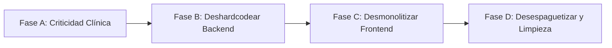

# 📋 Informe de Auditoría de Código & Deuda Técnica — BoozLab
## Booz Laboratorio (Clinical AI Platform)
**Skill aplicada:** `teamwork-review-engine` (4 roles: 🏛️ Backend/Architect, 🎨 Frontend/UI-UX, 📐 OpenSpec/SDD, 🧪 QA/TDD)  
**Modalidad:** Auditoría 100% de Lectura y Análisis Estático  
**Total de Hallazgos:** 64 hallazgos (28 backend, 36 frontend) • 19 de Severidad Alta  
**Estado Técnico Actual:** 134 Tests PHPUnit en Verde (544 assertions) • 12/12 Especificaciones OpenSpec Validadas

---

## 1. Resumen Ejecutivo

| Tipo | Backend | Frontend | Total | Severidad Alta 🔴 |
| :--- | :---: | :---: | :---: | :---: |
| **Hardcode** | 18 | 18 | 36 | 10 |
| **Monolítico** | 6 | 8 | 14 | 6 |
| **Espagueti** | 4 | 10 | 14 | 3 |
| **TOTAL** | **28** | **36** | **64** | **19** |

### Archivos Críticos con Mayor Densidad:
* `app/Http/Controllers/ChatbotController.php` (~300 líneas, 15.6 KB)
* `resources/js/pages/home.tsx` (1,494 líneas)
* `resources/js/pages/admin/products.tsx` (1,142 líneas)
* `resources/js/pages/admin/quotes.tsx` (1,137 líneas)
* `resources/js/pages/admin/ai.tsx` (1,128 líneas)
* `resources/js/pages/welcome.tsx` (807 líneas - archivo starter residual)

> [!IMPORTANT]
> **Alerta de Contenido Clínico MOCK (DEMO):**
> Casos clínicos (`cases.tsx`), glosario (`glossary.tsx`), blog (`blog/index.tsx`, `blog/show.tsx`) y calculadora pediátrica (`pediatric-calculator.tsx`) contienen datos ficticios (imágenes de `placehold.co`, lógica simulada `"Mock logic 15mg/kg"`) en una plataforma de salud. Deben migrarse a base de datos/seeders o alimentarse desde `A.docx` antes del despliegue en producción.

---

## 2. Hallazgos Backend (Laravel 12)

### 2.1 Código Hardcodeado — 18 Hallazgos

| # | Archivo:Línea | Descripción del Hallazgo | Severidad | Propuesta de Remediación |
| :--- | :--- | :--- | :---: | :--- |
| **H1** | `ChatbotController.php:18` | Disclaimer médico legal en constante privada de clase. | 🔴 Alta | Consumir desde `SystemSetting` (`legal_disclaimer`) vía `SettingService`. |
| **H2** | `ChatbotController.php:98,115` | `+58 414 8873615` embebido en respuestas deterministas (duplica `SettingService`). | 🔴 Alta | Componer dinámicamente desde `SettingService::whatsappPhone()`. |
| **H3** | `ChatbotController.php:115` | RIF J-40906185-0, direcciones físicas e Instagram `@booz.laboratorio` fijos en texto. | 🟠 Media | Añadir `company_instagram` y `company_address` a `SettingService`. |
| **H4** | `ChatbotController.php:148-158` | Respuestas de "4 líneas" y "18 fármacos" escritas a mano (duplica la BD). | 🔴 Alta | Generar dinámicamente desde `ProductLine::with('products')` y `Product::count()`. |
| **H5** | `ChatbotController.php:160-171` | Especificaciones clínicas de Bactrocis (Moxifloxacina 0.5%, biofilm) escritas a mano. | 🔴 Alta | Extraer datos desde el modelo `Product` (`indications`, `posology`, `description`). |
| **H6** | `ChatbotController.php:248-252` | Reglas de guardrail inyectadas a mano en prompt (duplican tabla `ai_guardrails`). | 🟠 Media | Unificar lectura exclusivamente desde `AiGuardrail::active()`. |
| **H7** | `ChatbotController.php:66` | Regex de detección clínica (`dosis`, `dolor`, `infecci`...) dispersa en método. | 🟠 Media | Centralizar en `ClinicalRulesService` o `SettingService`. |
| **H8** | `ChatbotController.php:255` y `AdminAiController.php:277` | URL de Google Gemini hardcodeada con inconsistencia de header vs `?key=`. | 🟠 Media | Centralizar en `config('services.gemini.base_url')` dentro de un `LiraAiService`. |
| **H9** | `ChatbotController.php:267-270` | `temperature: 0.3`, `maxOutputTokens: 600`, `timeout(8)` fijos en código. | 🟠 Media | Hacer configurables en `SystemSetting` desde `/admin/ai`. |
| **H10** | `PharmacovigilanceController.php:57`, `MessageController.php:41`, `MakeAdminCommand.php:29` | Correo `admin@boozlaboratorio.com` repetido en 3 archivos. | 🟠 Media | Unificar con `config('mail.from.address')` y `SettingService`. |
| **H11** | `SettingService.php:9-11` | Número `584148873615` repetido en 3 constantes distintas. | 🟡 Baja | Declarar una constante maestra y encadenar fallbacks. |
| **H12** | `routes/web.php:86`, `EnsureRole.php:25`, `EnsurePermission.php:24`, `User.php:75`, `AppServiceProvider.php:35-47` | Roles y permisos como "magic strings" (`super_admin`, `products.view`...). | 🟠 Media | Crear clase de constantes `RoleSlugs::SUPER_ADMIN` o Enum PHP 8.2+. |
| **H13** | `QuoteController.php:27-28`, `AdminQuoteController.php:182-183` | Prefijo `BOOZ-COT-` y formato `%s-%04d` duplicado en 2 controladores. | 🟠 Media | Centralizar en `Quote::generateQuoteNumber()` (igual que en Farmacovigilancia). |
| **H14** | `QuoteController.php:17-18`, `AdminQuoteController.php:171-221`, `StorePharmacovigilanceRequest.php:22` | Valores de enums (`customer_type`, `channel`, `severity`...) validados como strings sueltos. | 🟠 Media | Utilizar Enums respaldados en PHP (`CustomerType::class`, `Severity::class`). |
| **H15** | `AdminAiController.php:67-68,90,139,178,200` | Modelos de Gemini, categorías y tipos de guardrails en validaciones `in:`. | 🟠 Media | Centralizar en `config('services.gemini.models')` y constantes de modelo. |
| **H16** | `AdminProductController.php:24-33,81,125` | Array `$stockImages` y default `/assets/img/product_1.png` en controlador. | 🟡 Baja | Mover catálogo de imágenes base a `config('catalog.stock_images')`. |
| **H17** | `ChatbotController.php:234`, `AdminAiController.php:274` | Prompt base de Lira duplicado con textos ligeramente distintos. | 🟡 Baja | Centralizar en una única llamada a `SettingService::liraSystemPrompt()`. |
| **H18** | `QuoteController.php:43`, `PharmacovigilanceController.php:50`, `MessageController.php:36` | Valores por defecto (`Cliente Web`, `Paciente`, `Pendiente`) dispersos. | 🟡 Baja | Asignar desde los Enums de dominio correspondientes. |

---

### 2.2 Código Monolítico — 6 Hallazgos

| # | Archivo:Línea | Descripción del Hallazgo | Severidad | Propuesta de Remediación |
| :--- | :--- | :--- | :---: | :--- |
| **M1** | `ChatbotController.php:23-178` | Método `query()` de ~155 líneas: matching de productos + llamada Gemini + 7 flujos de intención + formateo HTML. | 🔴 Alta | Dividir en `ChatbotService` + `ProductMatcher` + `IntentRouterService`. |
| **M2** | `ChatbotController.php:183-290` vs `AdminAiController.php:262-291` | Ensamble del contexto RAG (productos + documentos + guardrails) duplicado casi línea por línea. | 🔴 Alta | Unificar en un único servicio desacoplado `LiraAiService`. |
| **M3** | `QuoteController.php:24-28` vs `AdminQuoteController.php:179-183` | Generación de código correlativo y conteo de consultas `quote_inquiries_count` duplicados. | 🟠 Media | Centralizar en `Quote::generateQuoteNumber()` y servicio comercial. |
| **M4** | `AdminQuoteController.php:17-164` | Método `index()` de ~150 líneas calculando filtros, KPIs, canales y top-10 de productos en el controlador. | 🟠 Media | Extraer a un `QuoteStatsService` dedicado. |
| **M5** | `PharmacovigilanceController.php:31-87`, `MessageController.php:14-69` | Validación + persistencia + despacho de email + disparo de webhook en el método `store()`. | 🟠 Media | Desacoplar mediante un servicio `NotificationDispatcher` o Eventos/Listeners. |
| **M6** | `ChatbotController.php:66,160-171` vs `AdminAiController.php:35-37` | Lógica clínica (detección de síntomas y especificaciones) dispersa entre controladores. | 🟠 Media | Extraer a `ClinicalRulesService`. |

---

### 2.3 Código Espagueti — 4 Hallazgos

| # | Archivo:Línea | Descripción del Hallazgo | Severidad | Propuesta de Remediación |
| :--- | :--- | :--- | :---: | :--- |
| **E1** | `ChatbotController.php:80-171` | 8 bloques `preg_match`/`str_contains` encadenados (intenciones frágiles dependientes del orden de evaluación). | 🔴 Alta | Implementar patrón *Chain of Responsibility* o tabla de intenciones (`IntentRegistry`). |
| **E2** | `ChatbotController.php:38-58` | Carga todo el catálogo activo en memoria PHP y lo filtra iterando palabras con regex. | 🟠 Media | Reemplazar por Scope SQL en Eloquent con búsqueda ponderada (`ProductMatcher`). |
| **E3** | `PharmacovigilanceController.php:63`, `MessageController.php:47`, `QuoteController.php:27` | Lectura directa de `env('ADMIN_ALERT_WEBHOOK_URL')` y parseo de correlativos en 3 sitios. | 🟠 Media | Reemplazar por `config('services.admin.webhook_url')` y método atómico de modelo. |
| **E4** | `AdminAiController.php:249-252` | El método de prueba `test()` instancia manualmente `ChatbotController` y le pasa un Request falso. | 🟠 Media | Reutilizar el servicio común `LiraAiService`. |

---

## 3. Hallazgos Frontend (React 19 / Inertia.js v2 / TypeScript / Tailwind CSS v4)

### 3.1 Código Hardcodeado — 18 Hallazgos

| # | Archivo:Línea | Descripción del Hallazgo | Severidad | Propuesta de Remediación |
| :--- | :--- | :--- | :---: | :--- |
| **A1** | `cases.tsx:5-30` | `MOCK_CASES`: 3 casos clínicos con URLs de `placehold.co` (Contenido DEMO). | 🔴 Alta | Migrar a tabla `clinical_cases` servida por props de Inertia. |
| **A2** | `glossary.tsx:6-13` | `MOCK_GLOSSARY`: 6 términos farmacéuticos fijos en cliente (Contenido DEMO). | 🔴 Alta | Migrar a tabla `glossary_terms` con buscador desde base de datos. |
| **A3** | `blog/index.tsx:5-33` | `MOCK_POSTS`: 3 artículos con fechas e imágenes estáticas (Contenido DEMO). | 🔴 Alta | Migrar a tabla `posts` con componente `BlogCard` reutilizable. |
| **A4** | `blog/show.tsx:7-31,84` | Contenido de post hardcodeado con `dangerouslySetInnerHTML`, ignora el `{slug}` de la URL. | 🔴 Alta | Conectar ruta `/blog/{slug}` al backend real. |
| **A5** | `home.tsx:637-643` | Array de 5 "necesidades clínicas" hardcodeado inline con emojis en el JSX. | 🟠 Media | Extraer a constante tipada `NEEDS` o catálogo dinámico. |
| **A6** | `home.tsx:124-143` | Filtro del Bento Grid usa IDs fijos (`=== 1/2/3/4`) y palabras clave ('biofilm', 'infecci'). | 🔴 Alta | Relacionar necesidades con líneas terapéuticas en base de datos. |
| **A7** | `admin/products.tsx:27,44,82,126` | Ruta fallback `/assets/img/product_1.png` repetida ≥6 veces; stock por defecto fijo en 100. | 🟠 Media | Centralizar en constante `DEFAULT_PRODUCT_IMAGE`. |
| **A8** | `hooks/use-whatsapp.ts:8-15` | Teléfono `584148873615` y textos de fallback duplicados en el cliente. | 🟠 Media | Consumir estrictamente desde `page.props.settings`. |
| **A9** | `admin/settings.tsx:26-35,54,134` | Teléfono repetido en inputs y ejemplos hardcodeados con `0414-8899111`. | 🟠 Media | Alimentar placeholders y estados únicamente desde `settings`. |
| **A10** | `booz-layout.tsx:344-350,415-450` | RIF, direcciones físicas y enlaces de redes sociales fijos en el footer. | 🟠 Media | Consumir desde `settings` globales compartidos en `HandleInertiaRequests`. |
| **A11** | `booz-layout.tsx:402-405` | Enlaces del footer a "Líneas Terapéuticas" estáticos, no vinculados a `productLines`. | 🟠 Media | Mapear dinámicamente desde el listado de líneas. |
| **A12** | `admin/quote-voucher.tsx:69-76,191` | Razón social, RIF y domicilio de planta fijos en la plantilla imprimible. | 🟠 Media | Consumir desde `settings.company_*`. |
| **A13** | `pediatric-calculator.tsx:9-17` | Lógica simulada `"Mock logic: 15mg per kg"` con `setTimeout` de 600ms (DEMO clínico). | 🔴 Alta | Implementar función matemática pura con regla de Clark oficial (`SPEC.md §3`). |
| **A14** | `home.tsx:104-107` | Constantes numéricas mágicas en la animación 3D (`/450`, `*20`). | 🟡 Baja | Extraer a constantes nombradas de configuración cinemática. |
| **A15** | `home.tsx:458-479` | Estadísticas destacadas ("18+ productos", "4 líneas", "100% INH") escritas a mano. | 🟠 Media | Calcular dinámicamente desde las props del catálogo. |
| **A16** | `welcome.tsx` (807 líneas) | Plantilla starter de Laravel/Inertia sin uso con colores ajenos (`#FF4433`, `#F8B803`). | 🟡 Baja | Archivo muerto/candidato a desincorporación. |
| **A17** | `home.tsx`, `booz-layout.tsx`, `products.tsx` | Códigos `#002072` y `#842D44` repetidos decenas de veces sin token de Tailwind. | 🟠 Media | Utilizar directiva `@theme` en Tailwind CSS v4 (`bg-booz-blue`, `text-booz-burgundy`). |
| **A18** | `blog/index.tsx`, `cases.tsx` | Enlaces a servicios externos `placehold.co` para maquetas de imágenes. | 🟠 Media | Utilizar activos SVG locales o fotografías oficiales de `storage/`. |

---

### 3.2 Código Monolítico — 8 Hallazgos

| # | Archivo | Tamaño Actual | Diagnóstico y Propuesta de Descomposición |
| :--- | :--- | :---: | :--- |
| **B1** | `home.tsx` | 1,494 líneas | Contiene 7 secciones completas, carrusel infinito y 4 modales. Extraer en: `HeroSection`, `CatalogCarousel`, `NeedsBentoGrid`, `ScientificAuthority`, `TestimonialsSection`, `HomeFaqSection`. |
| **B2** | `admin/products.tsx` | 1,142 líneas | Unifica tabla de inventario, editor en vivo y 3 formularios modales (campos duplicados entre líneas 520 y 919). Extraer en: `ProductsTable`, `ProductEditor`, `ProductFormModal`. |
| **B3** | `admin/quotes.tsx` | 1,137 líneas | Contiene 3 pestañas principales y 2 modales complejos de pedidos manuales. Extraer en: `QuotesTableTab`, `InventoryStockTab`, `CommercialFunnelTab`, `NewQuoteModal`. |
| **B4** | `admin/ai.tsx` | 1,128 líneas | Maneja 4 pestañas operativas y múltiples formularios de creación/edición. Extraer en: `KnowledgeBaseTab`, `GuardrailsTab`, `AiPlaygroundTab`, `GeminiConfigTab`. |
| **B5** | `booz-layout.tsx` | 514 líneas | Centraliza navbar, menú móvil, trinidad flotante, drawer de cotizaciones, footer y modales. Extraer en: `SiteHeader`, `SiteFooter`, `FloatingTrinity`, `CartDrawerProvider`. |
| **B6** | `lira-assistant-modal.tsx` | 445 líneas | Combina visualizador de chat, formulario de captura de leads y lógica de intenciones. Extraer en: `ChatMessageList`, `LeadCaptureForm`. |
| **B7** | `dashboard.tsx` | 418 líneas | Monolito de resumen ejecutivo con tarjetas de KPIs. Modularizar en componentes `KpiCard` reutilizables. |
| **B8** | `admin/settings.tsx` | 395 líneas | Contiene tarjetas de telefonía, bolsa de pedidos y datos legales. Descomponer en `PhoneSettingsCard`, `CartTemplateCard` y `LegalDataCard`. |

#### Oportunidades de Reutilización de UI Detectadas:
* **Tarjeta de Producto:** Duplicada en `home.tsx:969`, `product-detail.tsx:234` y `store-cart-drawer.tsx:139` ➡️ Unificar en componente `ProductCard`.
* **Badge "Récipe Médico Obligatorio / Venta Libre":** Repetido en 3 vistas con clases distintas ➡️ Unificar en `PrescriptionBadge`.
* **Barras de Filtro y Tablas Administrativas:** Patrones duplicados en las 4 páginas de `/admin/` ➡️ Unificar en `AdminDataTable` y `AdminFilterBar`.

---

### 3.3 Código Espagueti — 10 Hallazgos

| # | Archivo:Línea | Diagnóstico | Propuesta de Solución |
| :--- | :--- | :--- | :--- |
| **C1** | `home.tsx:113-147` vs `products.tsx:87-97` | Lógica de filtrado de productos por texto y línea duplicada en 2 páginas. | Crear hook personalizado `useProductFilter()`. |
| **C2** | `home.tsx:323-401`, `farmacovigilancia.tsx:29`, `lira-assistant-modal.tsx:126` | Creación manual de payloads JSON para reportes sanitarios y mensajes dispersa en 3 formularios. | Centralizar en servicio cliente `apiClient.ts` o hook `useSanitaryReport()`. |
| **C3** | `use-whatsapp.ts`, `messages.tsx`, `quotes.tsx`, `settings.tsx`, `store-cart-drawer.tsx`, `product-detail.tsx` | Lógica de formateo y construcción de URLs de `wa.me` dispersa en **≥6 archivos**. | Centralizar en librería de utilidades puras `lib/whatsapp.ts`. |
| **C4** | `admin/quotes.tsx:225`, `admin/settings.tsx:49` | Formateo numérico a dólares con `.toFixed(2)` y cálculo de subtotales disperso. | Extraer a utilidad pura `formatUSD()` y hook `useQuoteCart()`. |
| **C5** | `home.tsx:72`, `admin/quotes.tsx:32`, `admin/messages.tsx:18` | Listas de opciones de selects para estados (`Pendiente`, `En Revisión`...) duplicadas. | Extraer constantes globales compartidas `QUOTE_STATUS_OPTIONS`, `CUSTOMER_TYPES`. |
| **C6** | `home.tsx:34-147,189-307` | Lógica del carrusel infinito (buffer de 3 copias, gestos swipe, auto-reposicionamiento) mezclada con el estado de la página en un único `useEffect`. | Extraer a hook desacoplado `useInfiniteCarousel()` o componente `<InfiniteCarousel />`. |
| **C7** | `booz-layout.tsx:46-105` vs `store-cart-drawer.tsx` | Carrito global orquestado mediante eventos de ventana (`window.addEventListener('booz:cart-updated')`) y `localStorage`. | Reemplazar por un React Context limpio (`CartProvider` / `useCart`). |
| **C8** | `home.tsx:107,206-229`, `admin/ai.tsx:63` | Anchos responsivos en porcentajes (27%, 42%, 74%) y ternarios de color repetidos. | Centralizar en archivo de metadatos clínicos `lineMeta.ts`. |
| **C9** | `admin/products.tsx:331-339`, `home.tsx:566-574` | Clases de estilos y colores por línea terapéutica duplicadas en tablas y landings. | Extraer a mapeo compartido `LINE_COLOR_STYLES`. |
| **C10** | Múltiples archivos | Uso de clases arbitrarias (`text-[11px]`, `bg-[#002072]`, `shadow-xs` - clase inexistente en Tailwind v4). | Definir tokens corporativos oficiales en `resources/css/app.css`. |

---

## 4. TOP 10 Priorizado (Impacto Crítico Inmediato)

1. **M1 / E1 — `ChatbotController::query()` Monolítico:** Separar el matching de productos, llamadas a Gemini y enrutador de intenciones en servicios especializados.
2. **M2 / E4 — Duplicación del Motor RAG de Gemini:** Unificar el ensamble de contexto de `ChatbotController` y `AdminAiController` en un único `LiraAiService`.
3. **A1 a A4 — Contenido Clínico MOCK (DEMO):** Reemplazar datos ficticios y URLs de `placehold.co` por modelos persistentes en base de datos antes de producción.
4. **A13 — Calculadora Pediátrica Simulada:** Sustituir la lógica de juguete `"15 mg/kg"` por las fórmulas clínicas reales de Clark y regímenes de `A.docx` (`SPEC.md §3`).
5. **H4 — Catálogo de Fármacos Hardcodeado en Chatbot:** Alimentar las respuestas de "18 fármacos y 4 líneas" dinámicamente desde Eloquent.
6. **H5 — Especificaciones de Bactrocis en Código:** Extraer posología y biofilm dérmico desde el registro oficial en base de datos.
7. **B1 a B4 — 4 Páginas que Superan las 1,000 Líneas:** Modularizar `home.tsx`, `products.tsx`, `quotes.tsx` y `ai.tsx` en subcomponentes limpios.
8. **H1 / H2 / H3 — Datos de Contacto y Legal Hardcodeados:** Conectar disclaimer médico, WhatsApp, RIF e Instagram al `SettingService`.
9. **C3 — Construcción de URLs de WhatsApp Dispersa en ≥6 Archivos:** Unificar toda la lógica en `lib/whatsapp.ts`.
10. **H12 / H14 / H13 — Magic Strings en Roles y Correlativos:** Reemplazar cadenas sueltas por Enums PHP 8.2+ y método atómico `Quote::generateQuoteNumber()`.

---

## 5. Matriz de Remediación Futura por Fases



* **Fase A (Criticidad Clínica):** Resolver A13 (calculadora pediátrica real), A1-A4 (retirar MOCKs/placehold.co), H5 y A6 (reglas de catálogo reales).
* **Fase B (Deshardcodear Backend):** Resolver H1 a H18, M6 ➡️ Crear `LiraAiService`, Enums PHP para roles y canales, unificar lecturas con `SettingService`.
* **Fase C (Desmonolitizar Frontend):** Resolver B1 a B8 ➡️ Extraer `ProductCard`, `PrescriptionBadge`, `DataTable`, subcomponentes de `home.tsx` y tokens Tailwind v4.
* **Fase D (Desespaguetización e Integridad):** Resolver M1 a M5, E1 a E4 y C1 a C10 ➡️ `useProductFilter`, `lib/whatsapp.ts`, `CartContext`.

### Protocolo de Validación Cuádruple Obligatorio por Cada Fase:
```bash
php artisan test                 # 134 tests en verde
npm run build                    # compilación de producción sin errores
npm run opsx -- validate --specs # 12 especificaciones OpenSpec validadas
vendor/bin/pint --dirty          # estandarización de estilo PHP
```
*Trazabilidad histórica:* Toda remediación debe entrelazarse de forma aditiva en `MASTER_PLAN.md` e `HISTORY.md` sin borrar fases anteriores.

---

## 6. Dictamen y Conclusiones

1. **Riesgo de Desincronización Comprobado:** El panel de ajustes (`system_settings`) ya permite cambiar el número de WhatsApp oficial, pero si un usuario consulta en el chat determinista, `ChatbotController` sigue entregando el número fijo en código (Hallazgo H2). Corregir esto es prioritario para evitar inconsistencias comerciales.
2. **Excelente Base de Pruebas:** A pesar de la deuda técnica detectada, el sistema cuenta con **134 tests automatizados pasando al 100%**, lo que proporciona una red de seguridad ideal para ejecutar el refactoring de forma segura sin romper contratos existentes.
